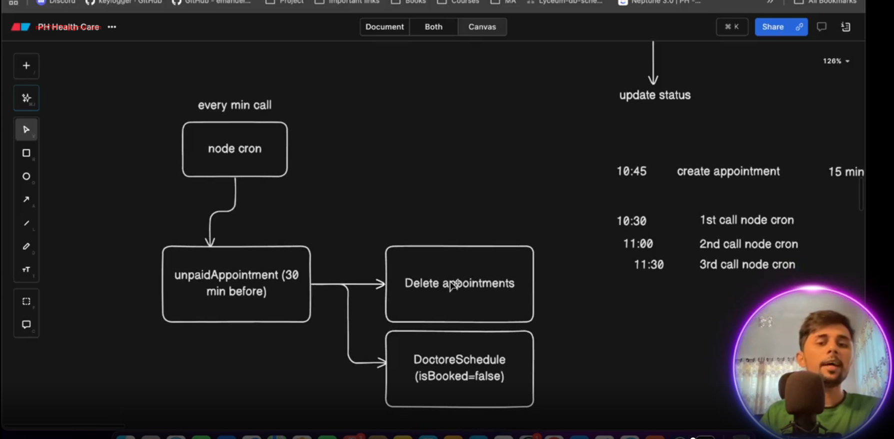

# TASK-SCHEDULING-DASHBOARD-ANALYSIS-BONUS

https://github.com/Apollo-Level2-Web-Dev/ph-health-care-server/tree/part-9

https://github.com/Apollo-Level2-Web-Dev/rate-limiting


## 64-1 Designing Strategy to Cancel Unpaid Appointments

- The strategy will be like when we book an appointment we will get 30 minutes of time to complete the payment. If not paid withing the 30 minute the payment and the appointment will be deleted and the isBooked status will be false again. 



- basically we will create a cron job  using `node cron npm` that will call in every minute and check if unpaid and if 30 minute exceeded then will do the operation for the unpaid appointments. 

```
npm i node-cron
```
- install the node cron

## 64-2 Implementing Task Scheduling with Node Cron

- appointment.service.ts 

```ts 
import { stripe } from "../../helper/stripe";
import { prisma } from '../../shared/prisma';
import { IJWTPayload } from "../../types/common";
import { v4 as uuidv4 } from 'uuid';
import { IOptions, paginationHelper } from "../../helper/paginationHelper";
import { AppointmentStatus, PaymentStatus, Prisma, UserRole } from "@prisma/client";
import ApiError from "../../errors/ApiError";
import httpStatus from 'http-status'


const cancelUnpaidAppointments = async () => {
    const thirtyMinuteAgo = new Date(Date.now() - 30 * 60 * 1000)
    //  time prior 30 minute 

    // find the appointments that are unpaid and created thirty minute before
    const unPaidAppointments = await prisma.appointment.findMany({
        where: {
            createdAt: {
                lte: thirtyMinuteAgo
            },
            paymentStatus: PaymentStatus.UNPAID
        }
    })

    const appointmentIdsToCancel = unPaidAppointments.map(appointment => appointment.id);

    await prisma.$transaction(async (tnx) => {
        // delete the payment
        await tnx.payment.deleteMany({
            where: {
                appointmentId: {
                    in: appointmentIdsToCancel
                }
            }
        })

        // delete appointment 

        await tnx.appointment.deleteMany({
            where: {
                id: {
                    in: appointmentIdsToCancel
                }
            }
        })

        // update the isBooked Status 
        for (const unPaidAppointment of unPaidAppointments) {
            await tnx.doctorSchedules.update({
                where: {
                    doctorId_scheduleId: {
                        doctorId: unPaidAppointment.doctorId,
                        scheduleId: unPaidAppointment.scheduleId
                    }
                },
                data: {
                    isBooked: false
                }
            })
        }

    })
}

export const AppointmentService = {
    cancelUnpaidAppointments
};
```