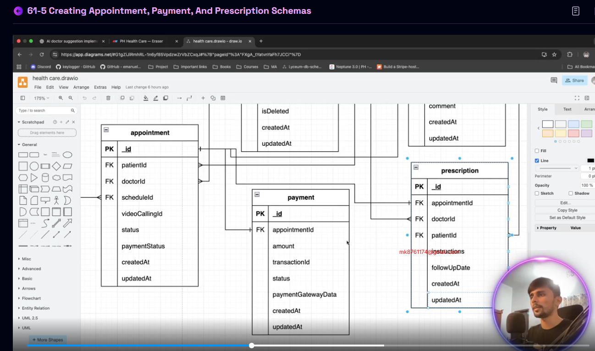
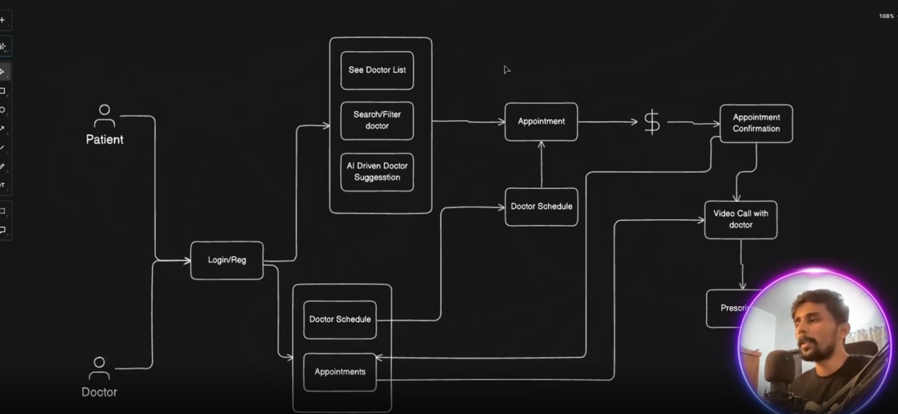

AI-DOCTOR-SUGGESTIONS-APPOINTMENT-AND-PAYMENT-SYSTEM

GitHub Link: https://github.com/Apollo-Level2-Web-Dev/ph-health-care-server/tree/part-6

## 61-1 Setting Up OpenRouter for AI Agent (OpenAI SDK Integration)
- How will ai agent will work ?


- we will use `open router` ai which is a part of open ai
- create a key, grab the key and set in .env 

- config -> index.ts 

```ts 
import dotenv from 'dotenv';
import path from 'path';

dotenv.config({ path: path.join(process.cwd(), '.env') });

export default {
    node_env: process.env.NODE_ENV,
    port: process.env.PORT,
    database_url: process.env.DATABASE_URL,
    cloudinary: {
        api_secret: process.env.CLOUDINARY_API_SECRET,
        cloud_name: process.env.CLOUDINARY_CLOUD_NAME,
        api_key: process.env.CLOUDINARY_API_KEY
    },
    openRouterApiKey : process.env.OPENROUTER_API_KEY
}
```

- lets install the open ai

```
npm i openai
```
## 61-2 Implementing AI-Driven Doctor Suggestion – Part 1
- helper -> open-router.ts 

```ts 
import OpenAI from 'openai';
import config from '../../config';

export const openai = new OpenAI({
  baseURL: 'https://openrouter.ai/api/v1',
  apiKey: config.openRouterApiKey,
});

```
- helpers -> open-router.ts 

```ts
import OpenAI from 'openai';
import config from '../../config';

const openai = new OpenAI({
  baseURL: 'https://openrouter.ai/api/v1',
  apiKey: config.openRouterApiKey,
  defaultHeaders: {
    'HTTP-Referer': '<YOUR_SITE_URL>', // Optional. Site URL for rankings on openrouter.ai.
    'X-Title': '<YOUR_SITE_NAME>', // Optional. Site title for rankings on openrouter.ai.
  },
});

async function main() {
  const completion = await openai.chat.completions.create({
    model: 'openai/gpt-4o',
    messages: [
      {
        role: 'user',
        content: 'What is the meaning of life?',
      },
    ],
  });

  console.log(completion.choices[0].message);
}

main();

```
- lets clean iup this according to our requirements 

- helper -> open-router.ts 

```ts 
import OpenAI from 'openai';
import config from '../../config';

export const openai = new OpenAI({
  baseURL: 'https://openrouter.ai/api/v1',
  apiKey: config.openRouterApiKey,
});
```
- doctor -> doctor.routes.ts 

```ts
import express from "express";
import { DoctorController } from "./doctor.controller";

const router = express.Router();

router.post("/suggestion", DoctorController.getAiSuggestions)


export const DoctorRoutes = router;
```
- doctor -> doctor.controller.ts 

```ts
import { Request, Response } from "express";
import catchAsync from "../../shared/catchAsync";
import { DoctorService } from "./doctor.service";
import sendResponse from "../../shared/sendResponse";


const getAiSuggestions = catchAsync(async (req: Request, res: Response) => {

    const result = await DoctorService.getAISuggestions(req.body);

    sendResponse(res, {
        statusCode: 200,
        success: true,
        message: "AI Suggestions Fetched successfully!",
        data: result
    })
})


 

export const DoctorController = {

    getAiSuggestions
}
```
- doctor -> doctor.service.ts 

```ts
import { Doctor, Prisma } from "@prisma/client";

import { prisma } from "../../shared/prisma";

import { openai } from "../../helper/open-router";


const getAISuggestions = async (payload: { symptoms: string }) => {
    // implement ai suggestion system 

    console.log(payload)

    if (!(payload && payload.symptoms)) {
        throw new ApiError(httpStatus.BAD_REQUEST, "Symptom is Required!")
    }

    const doctors = await prisma.doctor.findMany({
        where: {
            isDeleted: false
        },
        include: {
            doctorSpecialties: {
                include: {
                    specialities: true
                }
            }
        }
    })
    const prompt = `
You are a medical assistant AI. Based on the patient's symptoms, suggest the top 3 most suitable doctors.
Each doctor has specialties and years of experience.
Only suggest doctors who are relevant to the given symptoms.

Symptoms: ${payload.symptoms}

Here is the doctor list (in JSON):
${JSON.stringify(doctors, null, 2)}

Return your response in JSON format with full individual doctor data. 
`;

const completion = await openai.chat.completions.create({
    model: 'z-ai/glm-4.5-air:free',
    messages: [
      {
        role: 'system',
        content:  "You are a helpful AI medical assistant that provides doctor suggestions.",
      },
      {
        role: 'user',
        content: prompt,
      },
    ],
  });


    console.log(completion.choices[0].message);
}

export const DoctorService = {

    getAISuggestions
}

```
## 61-3 Implementing AI-Driven Doctor Suggestion – Part 2, 61-3 Implementing AI-Driven Doctor Suggestion – Part 2, 61-4 Implementing AI-Driven Doctor Suggestion – Part 3

- helper -> extractJsonFromMessage.ts

```ts 
export const extractJsonFromMessage = (message: any) => {
    try {
        const content = message?.content || "";

        // 1. Try to extract JSON code block (```json ... ```)
        const jsonBlockMatch = content.match(/```json([\s\S]*?)```/);
        if (jsonBlockMatch) {
            const jsonText = jsonBlockMatch[1].trim();
            return JSON.parse(jsonText);
        }

        // 2. If no code block, try to directly parse JSON if response is plain JSON
        if (content.trim().startsWith("[") || content.trim().startsWith("{")) {
            return JSON.parse(content);
        }

        // 3. Try to find the first JSON-like substring (fallback)
        const jsonFallbackMatch = content.match(/(\[[\s\S]*\]|\{[\s\S]*\})/);
        if (jsonFallbackMatch) {
            return JSON.parse(jsonFallbackMatch[1]);
        }

        // 4. If still no valid JSON found
        return [];
    } catch (error) {
        console.error("Error parsing AI response:", error);
        return [];
    }
};
```
- doctor.service.ts 


```ts 
import { Doctor, Prisma } from "@prisma/client";
import { prisma } from "../../shared/prisma";
import ApiError from "../../errors/ApiError";
import httpStatus from 'http-status';
import { openai } from "../../helper/open-router";
import { extractJsonFromMessage } from "../../helper/extractJsonFromMessage";


const getAISuggestions = async (payload: { symptoms: string }) => {
    // implement ai suggestion system 

    console.log(payload)

    if (!(payload && payload.symptoms)) {
        throw new ApiError(httpStatus.BAD_REQUEST, "Symptom is Required!")
    }

    const doctors = await prisma.doctor.findMany({
        where: {
            isDeleted: false
        },
        include: {
            doctorSpecialties: {
                include: {
                    specialities: true
                }
            }
        }
    })

    console.log("doctors data loaded......\n")

    const prompt = `
You are a medical assistant AI. Based on the patient's symptoms, suggest the top 3 most suitable doctors.
Each doctor has specialties and years of experience.
Only suggest doctors who are relevant to the given symptoms.

Symptoms: ${payload.symptoms}

Here is the doctor list (in JSON):
${JSON.stringify(doctors, null, 2)}

Return your response in JSON format with full individual doctor data. 
`;


    console.log("analyzing...\n")

    const completion = await openai.chat.completions.create({
        model: 'z-ai/glm-4.5-air:free',
        messages: [
            {
                role: 'system',
                content: "You are a helpful AI medical assistant that provides doctor suggestions.",
            },
            {
                role: 'user',
                content: prompt,
            },
        ],
    });


    console.log(doctors)

    console.log(completion.choices[0].message)

    const result = await extractJsonFromMessage(completion.choices[0].message)
    return result;
}

export const DoctorService = {
    getAISuggestions
}

```

```json
{
 "symptoms" : ":chestpain, shortness of breath, and irregular heartbeat"
}

```

## 61-5 Creating Appointment, Payment, and Prescription Schemas, 61-6 Defining Relationships & Migrating Appointment, Payment, and Prescription to Database



- appointment.prisma

```prisma 
model Appointment {
    id             String            @id @default(uuid())
    patientId      String
    patient        Patient           @relation(fields: [patientId], references: [id])
    doctorId       String
    doctor         Doctor            @relation(fields: [doctorId], references: [id])
    scheduleId     String
    schedule       Schedule          @relation(fields: [scheduleId], references: [id])
    videoCallingId String
    status         AppointmentStatus @default(SCHEDULED)
    paymentStatus  PaymentStatus     @default(UNPAID)
    createAt       DateTime          @default(now())
    updateAt       DateTime          @updatedAt
    payment        Payment?
    prescription   Prescription?

    @@map("appointments")
}

model Payment {
    id                 String        @id @default(uuid())
    appointmentId      String        @unique
    appointment        Appointment   @relation(fields: [appointmentId], references: [id])
    amount             Float
    transactionId      String        @unique
    status             PaymentStatus @default(UNPAID)
    paymentGatewayData Json?
    createAt           DateTime      @default(now())
    updateAt           DateTime      @updatedAt
    @@map("payments")
}

model Prescription {
    id            String      @id @default(uuid())
    appointmentId String      @unique
    appointment   Appointment @relation(fields: [appointmentId], references: [id])
    doctorId      String
    doctor        Doctor      @relation(fields: [doctorId], references: [id])
    patientId     String
    patient       Patient     @relation(fields: [patientId], references: [id])
    instructions  String
    followUpDate  DateTime?
    createAt      DateTime    @default(now())
    updateAt      DateTime    @updatedAt

    @@map("prescriptions")
}

```

- enum.prisma

```prisma 
enum UserRole {
  PATIENT
  DOCTOR
  ADMIN
}

enum UserStatus {
  ACTIVE
  INACTIVE
  DELETED
}

enum Gender {
  MALE
  FEMALE
}


enum AppointmentStatus {
    SCHEDULED
    INPROGRESS
    COMPLETED
    CANCEL
}

enum PaymentStatus {
    PAID
    UNPAID
}
```

- schedule.prisma 

```prisma
model Schedule {
    id              String            @id @default(uuid())
    startDateTime   DateTime
    endDateTime     DateTime
    createdAt       DateTime          @default(now())
    updatedAt       DateTime          @updatedAt
    doctorSchedules DoctorSchedules[]
    appointments    Appointment[]

    @@map("schedules")
}

model DoctorSchedules {
    doctorId   String
    doctor     Doctor   @relation(fields: [doctorId], references: [id])
    scheduleId String
    schedule   Schedule @relation(fields: [scheduleId], references: [id])
    isBooked   Boolean  @default(false)
    createdAt  DateTime @default(now())
    updatedAt  DateTime @updatedAt

    @@id([doctorId, scheduleId]) // composite primary key 
    // we have made primary key because these two needs to be different and because a doctor will not be able to see multiple patient at a time 
    @@map("doctor_schedules")
}
```

- user.prisma

```prisma
model User {
  id                 String     @id @default(uuid())
  email              String     @unique
  password           String
  role               UserRole   @default(PATIENT)
  needPasswordChange Boolean    @default(true)
  status             UserStatus @default(ACTIVE)
  createdAt          DateTime   @default(now())
  updatedAt          DateTime   @updatedAt
  admin              Admin?
  doctor             Doctor?
  patient            Patient?

  @@map("users") // in which name will be saved in the database 
}

model Admin {
  id            String   @id @default(uuid())
  name          String
  email         String   @unique
  profilePhoto  String?
  contactNumber String
  isDeleted     Boolean  @default(false)
  createdAt     DateTime @default(now())
  updatedAt     DateTime @updatedAt
  user          User     @relation(fields: [email], references: [email])

  @@map("admins")
}

model Doctor {
  id                  String   @id @default(uuid())
  name                String
  email               String   @unique
  profilePhoto        String?
  contactNumber       String
  address             String
  registrationNumber  String
  experience          Int      @default(0)
  gender              Gender
  appointmentFee      Int
  qualification       String
  currentWorkingPlace String
  designation         String
  isDeleted           Boolean  @default(false)
  createdAt           DateTime @default(now())
  updatedAt           DateTime @updatedAt
  user                User     @relation(fields: [email], references: [email])

  doctorSchedules   DoctorSchedules[]
  doctorSpecialties DoctorSpecialties[]
  appointments       Appointment[]
  prescriptions      Prescription[]

  @@map("doctors")
}

model Patient {
  id            String         @id @default(uuid())
  name          String
  email         String         @unique
  profilePhoto  String?
  address       String?
  isDeleted     Boolean        @default(false)
  createdAt     DateTime       @default(now())
  updatedAt     DateTime       @updatedAt
  user          User           @relation(fields: [email], references: [email])
  appointments  Appointment[]
  prescriptions Prescription[]

  @@map("patients")
}
```

## 61-7 Creating Appointment – Part 1, 61-8 Creating Appointment – Part 2, 61-9 Booking Appointment Functionality, 61-10 Creating Payment for Appointment




- `findUniqueOrThrow`: get exactly one record by unique field, throws if not found.

- `findFirstOrThrow`: get first matching record by filters, throws if none found.

- Both help avoid silent null bugs and make error handling cleaner.

- appointment.routes.ts

```ts 
import express from "express";
import { AppointmentController } from "./appointment.controller";
import auth from "../../middlewares/auth";
import { UserRole } from "@prisma/client";

const router = express.Router();

router.post(
    "/",
    auth(UserRole.PATIENT),
    AppointmentController.createAppointment
)

export const AppointmentRoutes = router;
```
- appointment.controller.ts

```ts 
import { Request, Response } from "express";
import catchAsync from "../../shared/catchAsync";
import { AppointmentService } from "./appointment.service";
import sendResponse from "../../shared/sendResponse";
import { IJWTPayload } from "../../types/common";


const createAppointment = catchAsync(async (req: Request & { user?: IJWTPayload }, res: Response) => {
    const user = req.user;
    const result = await AppointmentService.createAppointment(user as IJWTPayload, req.body);

    sendResponse(res, {
        statusCode: 201,
        success: true,
        message: "Appointment created successfully!",
        data: result
    })
});

export const AppointmentController = {
    createAppointment,
}
```
- appointment.service.ts

```ts 
import { prisma } from "../../shared/prisma";
import { IJWTPayload } from "../../types/common";
import { v4 as uuidv4 } from 'uuid';

const createAppointment = async (user: IJWTPayload, payload: { doctorId: string, scheduleId: string }) => {
    const patientData = await prisma.patient.findUniqueOrThrow({
        where: {
            email: user.email
        }
    });

    const doctorData = await prisma.doctor.findUniqueOrThrow({
        where: {
            id: payload.doctorId,
            isDeleted: false
        }
    });

    const isBookedOrNot = await prisma.doctorSchedules.findFirstOrThrow({
        where: {
            doctorId: payload.doctorId,
            scheduleId: payload.scheduleId,
            isBooked: false
        }
    })

    const videoCallingId = uuidv4();

    const result = await prisma.$transaction(async (tnx) => {
        const appointmentData = await tnx.appointment.create({
            data: {
                patientId: patientData.id,
                doctorId: doctorData.id,
                scheduleId: payload.scheduleId,
                videoCallingId
            }
        })

        await tnx.doctorSchedules.update({
            where: {
                doctorId_scheduleId: {
                    doctorId: doctorData.id,
                    scheduleId: payload.scheduleId
                }
            },
            data: {
                isBooked: true
            }
        })

        const transactionId = uuidv4();

        await tnx.payment.create({
            data: {
                appointmentId: appointmentData.id,
                amount: doctorData.appointmentFee,
                transactionId
            }
        })

        return appointmentData;
    })


    return result;
};

export const AppointmentService = {
    createAppointment,
};
```

```json
{
    "doctorId":"47dd05f7-0f84-4f2f-922a-cb94aac8ca3a",
    "scheduleId":"dd81072f-13f5-4957-936d-897fb2bcb11d"
}
```