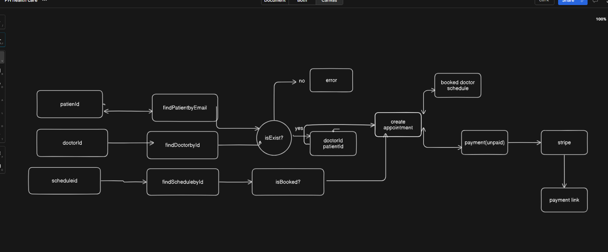

# STRIPE-PAYMENT-INTEGRATION-AND-APPOINTMENT-MANAGEMENT

GitHub Link: https://github.com/Apollo-Level2-Web-Dev/ph-health-care-server/tree/part-7

## 62-1 Stripe Payment Implementation – Part 1



- stripe -> documentation -> get started with payments -> for you -> accept online payment

[stripe](https://docs.stripe.com/checkout/quickstart)

- install stripe 

```
npm install --save stripe
```
- set the .env 

```
STRIPE_SECRET_KEY=
CLIENT_URL=
```

- config -> index.ts 

```ts
import dotenv from 'dotenv';
import path from 'path';

dotenv.config({ path: path.join(process.cwd(), '.env') });

export default {
    node_env: process.env.NODE_ENV,
    port: process.env.PORT,
    database_url: process.env.DATABASE_URL,
    cloudinary: {
        api_secret: process.env.CLOUDINARY_API_SECRET,
        cloud_name: process.env.CLOUDINARY_CLOUD_NAME,
        api_key: process.env.CLOUDINARY_API_KEY
    },
    openRouterApiKey: process.env.OPENROUTER_API_KEY,
    stripeSecretKey: process.env.STRIPE_SECRET_KEY
}
```

- helpers -> stripe.ts 

```ts 
import Stripe from "stripe"
import config from "../../config"

export const stripe = new Stripe(config.stripeSecretKey as string)
```

- create a session for the payment 

```ts 
        const session = await stripe.checkout.sessions.create({
            payment_method_types: ["card"],
            mode: "payment",
            customer_email: user.email,
            line_items: [
                {
                    price_data: {
                        currency: "bdt",
                        product_data: {
                            name: `Appointment with ${doctorData.name}`,
                        },
                        unit_amount: doctorData.appointmentFee * 100,
                    },
                    quantity: 1,
                },
            ],
            metadata: {
                appointmentId: appointmentData.id,
                paymentId: paymentData.id
            },
            success_url: `https://www.programming-hero.com/`,
            cancel_url: `https://next.programming-hero.com/`,
        });
```

- appointment.service.ts 

```ts
import { stripe } from "../../helper/stripe";
import { prisma } from "../../shared/prisma";
import { IJWTPayload } from "../../types/common";
import { v4 as uuidv4 } from 'uuid';

const createAppointment = async (user: IJWTPayload, payload: { doctorId: string, scheduleId: string }) => {
    const patientData = await prisma.patient.findUniqueOrThrow({
        where: {
            email: user.email
        }
    });

    const doctorData = await prisma.doctor.findUniqueOrThrow({
        where: {
            id: payload.doctorId,
            isDeleted: false
        }
    });

    const isBookedOrNot = await prisma.doctorSchedules.findFirstOrThrow({
        where: {
            doctorId: payload.doctorId,
            scheduleId: payload.scheduleId,
            isBooked: false
        }
    })

    const videoCallingId = uuidv4();

    const result = await prisma.$transaction(async (tnx) => {
        const appointmentData = await tnx.appointment.create({
            data: {
                patientId: patientData.id,
                doctorId: doctorData.id,
                scheduleId: payload.scheduleId,
                videoCallingId
            }
        })

        await tnx.doctorSchedules.update({
            where: {
                doctorId_scheduleId: {
                    doctorId: doctorData.id,
                    scheduleId: payload.scheduleId
                }
            },
            data: {
                isBooked: true
            }
        })

        const transactionId = uuidv4();

        const paymentData = await tnx.payment.create({
            data: {
                appointmentId: appointmentData.id,
                amount: doctorData.appointmentFee,
                transactionId
            }
        })

        const session = await stripe.checkout.sessions.create({
            payment_method_types: ["card"],
            mode: "payment",
            customer_email: user.email,
            line_items: [
                {
                    price_data: {
                        currency: "bdt",
                        product_data: {
                            name: `Appointment with ${doctorData.name}`,
                        },
                        unit_amount: doctorData.appointmentFee * 100,
                    },
                    quantity: 1,
                },
            ],
            metadata: {
                appointmentId: appointmentData.id,
                paymentId: paymentData.id
            },
            success_url: `https://www.programming-hero.com/`,
            cancel_url: `https://next.programming-hero.com/`,
        });

        return { paymentUrl: session.url };

        // console.log(session)
    })


    return result;
};


export const AppointmentService = {
    createAppointment,
};
```