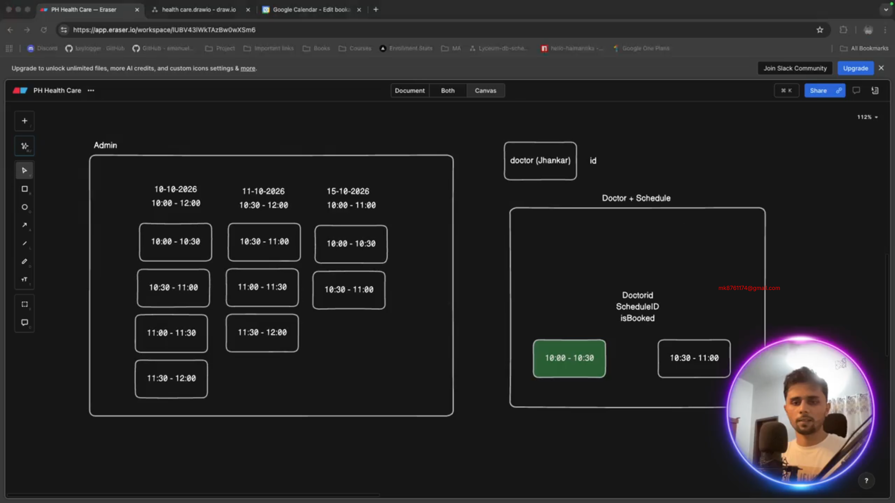
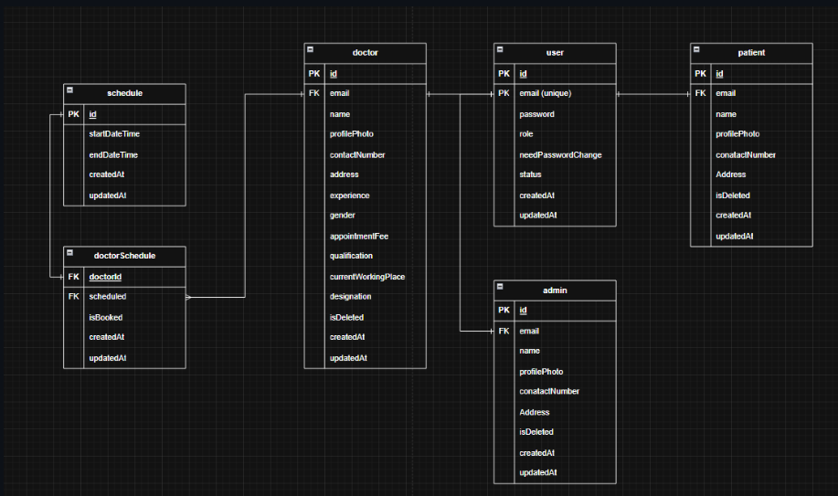

# Doctor-Schedule-Management

GitHub Link: https://github.com/Apollo-Level2-Web-Dev/ph-health-care-server/tree/part-4

## 59-1 Planning Schedule and Doctor Schedule Creation



- we want the time slot made by admin. 


- If we keep id and schedule in a table then the relation will be build. It like admin will add the schedule and that will be referenced from the schedule table to the doctors.
- The tables are doctor table, schedule table and doctorid+scheduleid table. 
- We will keep status for that the slot has been booked will never be available on that day. 

## 59-2 Writing Prisma Schema for Schedule and Doctor Schedule



- We will take start Time and end time and our system will make slot of 30 min for each patient 

- prisma -0> schema -> schedule.prisma

```prisma 
model Schedule {
    id              String            @id @default(uuid())
    startDateTime   DateTime
    endDateTime     DateTime
    createdAt       DateTime          @default(now())
    updatedAt       DateTime          @updatedAt
    doctorSchedules DoctorSchedules[]

    @@map("schedules")
}

model DoctorSchedules {
    doctorId   String
    doctor     Doctor   @relation(fields: [doctorId], references: [id])
    scheduleId String
    schedule   Schedule @relation(fields: [scheduleId], references: [id])
    isBooked   Boolean  @default(false)
    createdAt  DateTime @default(now())
    updatedAt  DateTime @updatedAt

    @@id([doctorId, scheduleId]) // composite primary key 
    // we have made primary key because these two needs to be different and because a doctor will not be able to see multiple patient at a time 
    @@map("doctor_schedules")
}
```
- user.prisma -> Doctor model 

```prisma
model Doctor {
  id                  String   @id @default(uuid())
  name                String
  email               String   @unique
  profilePhoto        String?
  contactNumber       String
  address             String
  registrationNumber  String
  experience          Int      @default(0)
  gender              Gender
  appointmentFee      Int
  qualification       String
  currentWorkingPlace String
  designation         String
  isDeleted           Boolean  @default(false)
  createdAt           DateTime @default(now())
  updatedAt           DateTime @updatedAt
  user                User     @relation(fields: [email], references: [email])

  doctorSchedules DoctorSchedules[]

  @@map("doctors")
}
```

- A Doctor can have many Schedules.
- A Schedule can belong to many Doctors.

## 59-3 Creating Schedule – Part 1, 59-4 Creating Schedule – Part 2,3
- install date fan 

```
npm i date-fns
```
- routes -> index.ts 

```ts 
import express from 'express';
import { UserRoutes } from '../modules/user/user.routes';
import { AuthRoutes } from '../modules/auth/auth.route';
import { ScheduleRoutes } from '../modules/schedule/schedule.routes';


const router = express.Router();

const moduleRoutes = [
    {
        path: '/user',
        route: UserRoutes
    },
    {
        path: '/auth',
        route: AuthRoutes
    },
    {
        path: '/schedule',
        route: ScheduleRoutes
    }
];

moduleRoutes.forEach(route => router.use(route.path, route.route))

export default router;
```
- schedule -> schedule.routes.ts 

```ts 
import express from 'express'
import { ScheduleController } from './schedule.controller'


const router = express.Router()

router.post("/", ScheduleController.insertIntoDB)

export const ScheduleRoutes = router
```
- schedule -> schedule.controller.ts 

```ts 
import { Request, Response } from "express";
import catchAsync from "../../shared/catchAsync";
import sendResponse from "../../shared/sendResponse";
import { ScheduleService } from "./schedule.service";


const insertIntoDB = catchAsync(async (req: Request, res: Response) => {

    const result = await ScheduleService.insertIntoDB(req.body)

    sendResponse(res, {
        statusCode: 201,
        success: true,
        message: "Schedule Created Successfully",
        data: result
    })
})

export const ScheduleController = {
    insertIntoDB
}
```
- schedule -> schedule.service.ts 

```ts 
import { addHours, addMinutes, format } from "date-fns";
import { prisma } from "../../shared/prisma";

// ========================
// 🧩 PURPOSE OF FUNCTION
// ========================
// This function takes a date range (startDate → endDate)
// and a time range (startTime → endTime),
// then automatically generates 30-minute time slots
// for each day in that range.
//
// Each time slot is stored in the database (if it doesn’t already exist)
// using Prisma ORM. 
//
// Example:
// Input → startDate: "2025-10-14", endDate: "2025-10-15", startTime: "09:00", endTime: "12:00"
// Output → Creates time slots like:
//  2025-10-14 09:00 - 09:30
//  2025-10-14 09:30 - 10:00
//  ...
//  2025-10-15 11:30 - 12:00
// ========================

const insertIntoDB = async (payload: any) => {

    // Destructure user-provided values from request body or input payload
    const { startTime, endTime, startDate, endDate } = payload;

    const intervalTime = 30; // each appointment slot will be 30 minutes long
    const schedules: any[] = []; // this will store all newly created schedule entries

    // Convert plain date strings (like "2025-10-14") into JavaScript Date objects
    const currentDate = new Date(startDate); // will start from this day
    const lastDate = new Date(endDate);      // will stop at this day

    // ===============================
    // 🔁 OUTER LOOP (for each date)
    // ===============================
    // This loop will run for each day between startDate → endDate.
    // Example: if startDate=Oct 14 and endDate=Oct 16,
    // this loop runs 3 times → Oct 14, 15, 16
    while (currentDate <= lastDate) {

        // Build a DateTime object for when the workday starts (e.g., "09:00" on this date)
        const startDateTime = new Date(
            addMinutes(
                addHours(
                    // format(currentDate, "yyyy-MM-dd") converts the Date object to a string like "2025-10-14"
                    // ❗️But note: passing a string to addHours is logically wrong (addHours expects a Date)
                    `${format(currentDate, "yyyy-MM-dd")}`,
                    Number(startTime.split(":")[0]) // Extract the "hour" part from "09:00" → 9
                ),
                Number(startTime.split(":")[1])     // Extract the "minute" part from "09:00" → 0
            )
        );

        // Build a DateTime object for when the workday ends (e.g., "17:00" on this date)
        const endDateTime = new Date(
            addMinutes(
                addHours(
                    `${format(currentDate, "yyyy-MM-dd")}`,
                    Number(endTime.split(":")[0])   // Extract hour part from endTime → e.g. 17
                ),
                Number(endTime.split(":")[1])       // Extract minute part → e.g. 0
            )
        );

        // ===========================================
        // 🔁 INNER LOOP (for each time slot of the day)
        // ===========================================
        // Example: if startTime=09:00 and endTime=12:00,
        // this loop will create slots like:
        // 09:00–09:30, 09:30–10:00, 10:00–10:30, ...
        while (startDateTime < endDateTime) {
            
            // Define start and end of the current 30-minute slot
            const slotStartDateTime = startDateTime;                 // current start time
            const slotEndDateTime = addMinutes(startDateTime, intervalTime); // add 30 minutes for the end time

            // Build an object representing this slot (this is what will be saved in DB)
            const scheduleData = {
                startDateTime: slotStartDateTime,
                endDateTime: slotEndDateTime
            };

            // 🔍 Step 1: Check if a schedule with exactly the same times already exists in DB
            // We don’t want duplicate schedule slots in the table.
            const existingSchedule = await prisma.schedule.findFirst({
                where: scheduleData
            });

            // ✅ Step 2: If it doesn’t exist, insert it into the database
            if (!existingSchedule) {
                const result = await prisma.schedule.create({
                    data: scheduleData
                });
                schedules.push(result); // add the created record to our local array
            }

            // ⏩ Step 3: Move the start time 30 minutes forward for the next slot
            // Example: if current slot was 09:00–09:30, next will be 09:30–10:00
            slotStartDateTime.setMinutes(slotStartDateTime.getMinutes() + intervalTime);
        }

        // 📅 Step 4: Once we’re done with one full day, move to the next date
        // This increases "currentDate" by 1 day.
        // Example: from 2025-10-14 → 2025-10-15
        currentDate.setDate(currentDate.getDate() + 1);
    }

    // 🧾 Return all newly created schedules so the caller can see what was generated
    return schedules;
};


// Export this service so it can be imported in other modules, like controllers
export const ScheduleService = {
    insertIntoDB
};

```

```json
{
    "startDate": "2025-10-17",
    "endDate": "2025-10-17",
    "startTime":"10:00",
    "endTime":"11:00"
}
```

## 

```
{{URL}}/schedule?startDateTime=2025-10-16T11:00:00.000Z&endDateTime=2025-10-17T11:00:00.000Z
```

- user.routes.ts 

```ts 
import express from 'express'
import { ScheduleController } from './schedule.controller'


const router = express.Router()

router.get("/", ScheduleController.schedulesForDoctor)

export const ScheduleRoutes = router
```

- schedule.controller.ts 

```ts 
import { Request, Response } from "express";
import catchAsync from "../../shared/catchAsync";
import sendResponse from "../../shared/sendResponse";
import { ScheduleService } from "./schedule.service";
import pick from "../../helper/pick";


const schedulesForDoctor = catchAsync(async (req: Request, res: Response) => {
        const options = pick(req.query, ["page", "limit", "sortBy", "sortOrder"]) // pagination and sorting
        const filters = pick(req.query,["startDateTime", "endDateTime"])
    const result = await ScheduleService.schedulesForDoctor(filters, options)

    sendResponse(res, {
        statusCode: 201,
        success: true,
        message: "Schedule fetched Successfully",
        data: result
    })
})

export const ScheduleController = {
    schedulesForDoctor
}
```

- schedule.service.ts 

```ts 
import { addHours, addMinutes, format } from "date-fns";
import { prisma } from "../../shared/prisma";
import { IOptions, paginationHelper } from "../../helper/paginationHelper";
import { Prisma } from "@prisma/client";


const schedulesForDoctor = async (filters: any, options: IOptions) => {
    const { page, limit, skip, sortBy, sortOrder } = paginationHelper.calculatePagination(options)
    const { startDateTime: filterStartDateTime, endDateTime: filterEndDateTime } = filters

    const andConditions: Prisma.ScheduleWhereInput[] = [];

    if (filterStartDateTime && filterEndDateTime) {
        andConditions.push({
            AND: [
                {
                    startDateTime: {
                        gte: filterStartDateTime
                    }
                },
                {
                    endDateTime: {
                        lte: filterEndDateTime
                    }
                }
            ]
        })
    }

    const whereConditions: Prisma.ScheduleWhereInput = andConditions.length > 0 ? {
        AND: andConditions
    } : {}

    const result = await prisma.schedule.findMany({
        where: whereConditions,
        skip,
        take: limit,
        orderBy: {
            [sortBy]: sortOrder
        }
    })

    const total = await prisma.schedule.count({
        where: whereConditions
    });

    return {
        meta: {
            page,
            limit,
            total
        },
        data: result
    };

}


// Export this service so it can be imported in other modules, like controllers
export const ScheduleService = {
    schedulesForDoctor
};

```

## 59-7 Deleting Schedule from the Database

- schedule.routes.ts 

```ts 
import express from 'express'
import { ScheduleController } from './schedule.controller'


const router = express.Router()

router.get("/", ScheduleController.schedulesForDoctor)

router.post("/", ScheduleController.insertIntoDB)
router.delete("/:id", ScheduleController.deleteScheduleFromDB)

export const ScheduleRoutes = router
```
- schedule.controller.ts 

```ts 
import { Request, Response } from "express";
import catchAsync from "../../shared/catchAsync";
import sendResponse from "../../shared/sendResponse";
import { ScheduleService } from "./schedule.service";
import pick from "../../helper/pick";


const insertIntoDB = catchAsync(async (req: Request, res: Response) => {

    const result = await ScheduleService.insertIntoDB(req.body)

    sendResponse(res, {
        statusCode: 201,
        success: true,
        message: "Schedule Created Successfully",
        data: result
    })
})
const schedulesForDoctor = catchAsync(async (req: Request, res: Response) => {
    const options = pick(req.query, ["page", "limit", "sortBy", "sortOrder"]) // pagination and sorting
    const filters = pick(req.query, ["startDateTime", "endDateTime"])
    const result = await ScheduleService.schedulesForDoctor(filters, options)

    sendResponse(res, {
        statusCode: 201,
        success: true,
        message: "Schedule fetched Successfully",
        meta: result.meta,
        data: result.data
    })
})
const deleteScheduleFromDB = catchAsync(async (req: Request, res: Response) => {

    const result = await ScheduleService.deleteScheduleFromDB(req.params.id)

    console.log(result)

    sendResponse(res, {
        statusCode: 200,
        success: true,
        message: "Schedule deleted Successfully",
        data: result
    })
})

export const ScheduleController = {
    insertIntoDB,
    schedulesForDoctor,
    deleteScheduleFromDB
}
```
- schedule.service.ts 

```ts 
import { addHours, addMinutes, format } from "date-fns";
import { prisma } from "../../shared/prisma";
import { IOptions, paginationHelper } from "../../helper/paginationHelper";
import { Prisma } from "@prisma/client";

// ========================
// 🧩 PURPOSE OF FUNCTION
// ========================
// This function takes a date range (startDate → endDate)
// and a time range (startTime → endTime),
// then automatically generates 30-minute time slots
// for each day in that range.
//
// Each time slot is stored in the database (if it doesn’t already exist)
// using Prisma ORM. 
//
// Example:
// Input → startDate: "2025-10-14", endDate: "2025-10-15", startTime: "09:00", endTime: "12:00"
// Output → Creates time slots like:
//  2025-10-14 09:00 - 09:30
//  2025-10-14 09:30 - 10:00
//  ...
//  2025-10-15 11:30 - 12:00
// ========================

const insertIntoDB = async (payload: any) => {

    // Destructure user-provided values from request body or input payload
    const { startTime, endTime, startDate, endDate } = payload;

    const intervalTime = 30; // each appointment slot will be 30 minutes long
    const schedules: any[] = []; // this will store all newly created schedule entries

    // Convert plain date strings (like "2025-10-14") into JavaScript Date objects
    const currentDate = new Date(startDate); // will start from this day
    const lastDate = new Date(endDate);      // will stop at this day

    // ===============================
    // 🔁 OUTER LOOP (for each date)
    // ===============================
    // This loop will run for each day between startDate → endDate.
    // Example: if startDate=Oct 14 and endDate=Oct 16,
    // this loop runs 3 times → Oct 14, 15, 16
    while (currentDate <= lastDate) {

        // Build a DateTime object for when the workday starts (e.g., "09:00" on this date)
        const startDateTime = new Date(
            addMinutes(
                addHours(
                    // format(currentDate, "yyyy-MM-dd") converts the Date object to a string like "2025-10-14"
                    // ❗️But note: passing a string to addHours is logically wrong (addHours expects a Date)
                    `${format(currentDate, "yyyy-MM-dd")}`,
                    Number(startTime.split(":")[0]) // Extract the "hour" part from "09:00" → 9
                ),
                Number(startTime.split(":")[1])     // Extract the "minute" part from "09:00" → 0
            )
        );

        // Build a DateTime object for when the workday ends (e.g., "17:00" on this date)
        const endDateTime = new Date(
            addMinutes(
                addHours(
                    `${format(currentDate, "yyyy-MM-dd")}`,
                    Number(endTime.split(":")[0])   // Extract hour part from endTime → e.g. 17
                ),
                Number(endTime.split(":")[1])       // Extract minute part → e.g. 0
            )
        );

        // ===========================================
        // 🔁 INNER LOOP (for each time slot of the day)
        // ===========================================
        // Example: if startTime=09:00 and endTime=12:00,
        // this loop will create slots like:
        // 09:00–09:30, 09:30–10:00, 10:00–10:30, ...
        while (startDateTime < endDateTime) {

            // Define start and end of the current 30-minute slot
            const slotStartDateTime = startDateTime;                 // current start time
            const slotEndDateTime = addMinutes(startDateTime, intervalTime); // add 30 minutes for the end time

            // Build an object representing this slot (this is what will be saved in DB)
            const scheduleData = {
                startDateTime: slotStartDateTime,
                endDateTime: slotEndDateTime
            };

            // 🔍 Step 1: Check if a schedule with exactly the same times already exists in DB
            // We don’t want duplicate schedule slots in the table.
            const existingSchedule = await prisma.schedule.findFirst({
                where: scheduleData
            });

            // ✅ Step 2: If it doesn’t exist, insert it into the database
            if (!existingSchedule) {
                const result = await prisma.schedule.create({
                    data: scheduleData
                });
                schedules.push(result); // add the created record to our local array
            }

            // ⏩ Step 3: Move the start time 30 minutes forward for the next slot
            // Example: if current slot was 09:00–09:30, next will be 09:30–10:00
            slotStartDateTime.setMinutes(slotStartDateTime.getMinutes() + intervalTime);
        }

        // 📅 Step 4: Once we’re done with one full day, move to the next date
        // This increases "currentDate" by 1 day.
        // Example: from 2025-10-14 → 2025-10-15
        currentDate.setDate(currentDate.getDate() + 1);
    }

    // 🧾 Return all newly created schedules so the caller can see what was generated
    return schedules;
};

const schedulesForDoctor = async (filters: any, options: IOptions) => {
    const { page, limit, skip, sortBy, sortOrder } = paginationHelper.calculatePagination(options)
    const { startDateTime: filterStartDateTime, endDateTime: filterEndDateTime } = filters

    const andConditions: Prisma.ScheduleWhereInput[] = [];

    if (filterStartDateTime && filterEndDateTime) {
        andConditions.push({
            AND: [
                {
                    startDateTime: {
                        gte: filterStartDateTime
                    }
                },
                {
                    endDateTime: {
                        lte: filterEndDateTime
                    }
                }
            ]
        })
    }

    const whereConditions: Prisma.ScheduleWhereInput = andConditions.length > 0 ? {
        AND: andConditions
    } : {}

    const result = await prisma.schedule.findMany({
        where: whereConditions,
        skip,
        take: limit,
        orderBy: {
            [sortBy]: sortOrder
        }
    })

    const total = await prisma.schedule.count({
        where: whereConditions
    });

    return {
        meta: {
            page,
            limit,
            total
        },
        data: result
    };

}

const deleteScheduleFromDB = async (id: string) => {
    console.log(id)
    return await prisma.schedule.delete({
        where: {
            id
        }
    })
}


// Export this service so it can be imported in other modules, like controllers
export const ScheduleService = {
    insertIntoDB,
    schedulesForDoctor,
    deleteScheduleFromDB
};

```