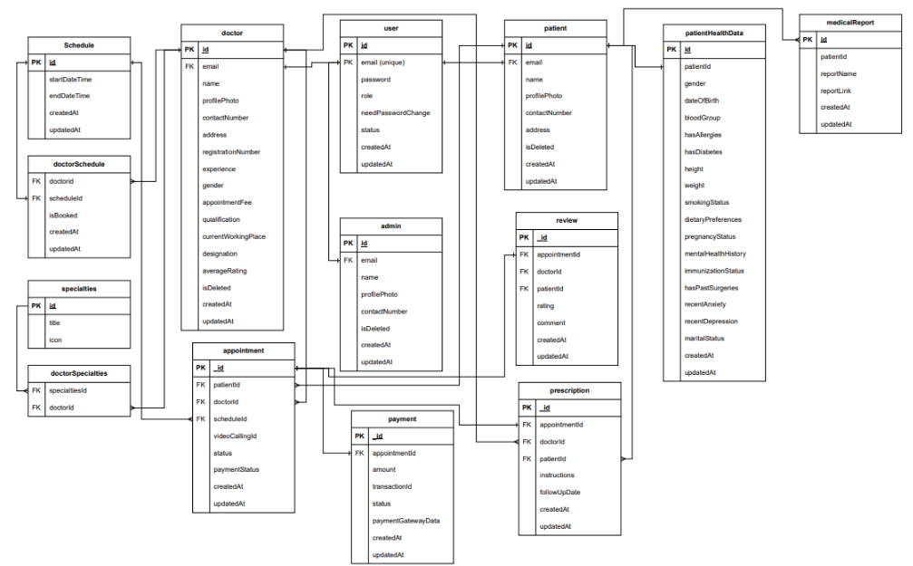

# REVIEWS-PATIENT-HEALTH-DATA-AND-MEDICAL-REPORT-SCHEMA-AND-CREATING-REVIEW

GitHub Repo:  https://github.com/Apollo-Level2-Web-Dev/ph-health-care-server/tree/part-8

ERD: https://drive.google.com/file/d/1x7Bi_oiIAUjNGINIz3rUYaXUUBvAduEs/view?usp=sharing

Diagrams: https://drive.google.com/file/d/1PWtMG-PF0HcC_UUTYVXNZ4BjY2Jm09zE/view?usp=drive_link

## 63-1 Designing Review, Patient Health Data, and Medical Report Schemas & Creating Review



- review.routes.ts 

```ts 
import { UserRole } from '@prisma/client';
import express from 'express';
import auth from '../../middlewares/auth';
import { ReviewController } from './review.controller';
const router = express.Router()


router.post("/",
    auth(UserRole.PATIENT),
    ReviewController.insertIntoDB
)

export const ReviewRoutes = router;


```
- review.controller.ts 

```ts 
import { Request, Response } from "express";
import catchAsync from "../../shared/catchAsync";
import { IJWTPayload } from "../../types/common";
import sendResponse from "../../shared/sendResponse";
import httpStatus from 'http-status';
import { ReviewService } from "./review.service";

const insertIntoDB = catchAsync(async(req:Request &{user?:IJWTPayload}, res:Response) =>{
    const user = req.user
    const result = await ReviewService.insertIntoDB(user as IJWTPayload, req.body)

    sendResponse(res, {
        statusCode : httpStatus.OK,
        success: true,
        message : "Review Created Successfully",
        data : result
    })
})

export const ReviewController ={
    insertIntoDB
} 
```
- review.service.ts 

```ts 
import ApiError from "../../errors/ApiError"
import { prisma } from "../../shared/prisma"
import { IJWTPayload } from "../../types/common"
import httpStatus from 'http-status';

const insertIntoDB = async (user: IJWTPayload, payload: any) => {
    const patientData = await prisma.patient.findUniqueOrThrow({
        where: {
            email: user.email
        }
    })

    const appointmentData = await prisma.appointment.findFirstOrThrow({
        where: {
            id: payload.appointmentId
        }
    })

    if (patientData.id !== appointmentData.patientId) {
        throw new ApiError(httpStatus.BAD_REQUEST, "This is Not Your Appointment")
    }

    
}

export const ReviewService = {
    insertIntoDB
} 
```

## 63-2 Creating Review – Part 2

- user.prisma

```prisma 
model Doctor {
    id                  String   @id @default(uuid())
    name                String
    email               String   @unique
    profilePhoto        String?
    contactNumber       String
    address             String
    registrationNumber  String
    experience          Int      @default(0)
    gender              Gender
    appointmentFee      Int
    qualification       String
    currentWorkingPlace String
    designation         String
    averageRating       Float    @default(0.0) // average rating added
    isDeleted           Boolean  @default(false)
    createdAt           DateTime @default(now())
    updatedAt           DateTime @updatedAt

    user User @relation(fields: [email], references: [email])

    doctorSchedules   DoctorSchedules[]
    doctorSpecialties DoctorSpecialties[]
    appointments      Appointment[]
    prescriptions     Prescription[]
    reviews           Review[]

    @@map("doctors")
}
```
- review.service.ts 

```ts 
import ApiError from "../../errors/ApiError"
import { prisma } from "../../shared/prisma"
import { IJWTPayload } from "../../types/common"
import httpStatus from 'http-status';

const insertIntoDB = async (user: IJWTPayload, payload: any) => {
    const patientData = await prisma.patient.findUniqueOrThrow({
        where: {
            email: user.email
        }
    })

    const appointmentData = await prisma.appointment.findFirstOrThrow({
        where: {
            id: payload.appointmentId
        }
    })

    if (patientData.id !== appointmentData.patientId) {
        throw new ApiError(httpStatus.BAD_REQUEST, "This is Not Your Appointment")
    }

    return await prisma.$transaction(async (tnx) => {
        const result = await tnx.review.create({
            data: {
                appointmentId: appointmentData.id,
                doctorId: appointmentData.doctorId,
                patientId: appointmentData.patientId,
                rating: payload.rating,
                comment: payload.comment
            }
        });

        const avgRating = await tnx.review.aggregate({
            _avg: {
                rating: true
            },
            where: {
                doctorId: appointmentData.doctorId
            }
        })

        await tnx.doctor.update({
            where: {
                id: appointmentData.doctorId
            },
            data: {
                averageRating: avgRating._avg.rating as number
            }
        })

        return result
    })

}

export const ReviewService = {
    insertIntoDB
} 
```

## 63-3 Implementing Review Creation & Including Reviews in Data Retrieval

- postman 

```json 
{
    "appointmentId": "d37c4dda-be78-446a-b4d8-dbdad9f05bac",
    "rating": 4.8,
    "comment": "The Doctor is Bad"
}
```

- showing doctor reviews

- doctor.service.ts 

```ts 
const getAllFromDB = async (filters: any, options: IOptions) => {
    const { page, limit, skip, sortBy, sortOrder } = paginationHelper.calculatePagination(options);
    const { searchTerm, specialties, ...filterData } = filters;

    const andConditions: Prisma.DoctorWhereInput[] = [];

    if (searchTerm) {
        andConditions.push({
            OR: doctorSearchableFields.map((field) => ({
                [field]: {
                    contains: searchTerm,
                    mode: "insensitive"
                }
            }))
        })
    }

    // "", "medicine"
    if (specialties && specialties.length > 0) {
        andConditions.push({
            doctorSpecialties: {
                some: {
                    specialities: {
                        title: {
                            contains: specialties,
                            mode: "insensitive"
                        }
                    }
                }
            }
        })
    }

    if (Object.keys(filterData).length > 0) {
        const filterConditions = Object.keys(filterData).map((key) => ({
            [key]: {
                equals: (filterData as any)[key]
            }
        }))

        andConditions.push(...filterConditions)
    }

    const whereConditions: Prisma.DoctorWhereInput = andConditions.length > 0 ? { AND: andConditions } : {};

    const result = await prisma.doctor.findMany({
        where: whereConditions,
        skip,
        take: limit,
        orderBy: {
            [sortBy]: sortOrder
        },
        include: {
            doctorSpecialties: {
                include: {
                    specialities: true
                }
            },
            reviews: {
                select: {
                    rating: true
                }
            }
        }
    });

    const total = await prisma.doctor.count({
        where: whereConditions
    })

    return {
        meta: {
            total,
            page,
            limit
        },
        data: result
    }
}

const getByIdFromDB = async (id: string): Promise<Doctor | null> => {
    const result = await prisma.doctor.findUnique({
        where: {
            id,
            isDeleted: false,
        },
        include: {
            doctorSpecialties: {
                include: {
                    specialities: true,
                },
            },
            doctorSchedules: {
                include: {
                    schedule: true
                }
            },
            reviews: true
        },
    });
    return result;
};

```

## 63-4 Creating or Updating Patient Health Data – Part 1, 63-5 Creating or Updating Patient Health Data – Part 2
```prisma
model PatientHealthData {
    id                  String        @id @default(uuid())
    patientId           String        @unique
    patient             Patient       @relation(fields: [patientId], references: [id])
    gender              Gender
    dateOfBirth         String
    bloodGroup          BloodGroup
    hasAllergies        Boolean?      @default(false)
    hasDiabetes         Boolean?      @default(false)
    height              String
    weight              String
    smokingStatus       Boolean?      @default(false)
    dietaryPreferences  String?
    pregnancyStatus     Boolean?      @default(false)
    mentalHealthHistory String?
    immunizationStatus  String?
    hasPastSurgeries    Boolean?      @default(false)
    recentAnxiety       Boolean?      @default(false)
    recentDepression    Boolean?      @default(false)
    maritalStatus       MaritalStatus @default(UNMARRIED)
    createdAt           DateTime      @default(now())
    updatedAt           DateTime      @updatedAt

    @@map("patient_health_datas")
}

model MedicalReport {
    id         String   @id @default(uuid())
    patientId  String
    patient    Patient  @relation(fields: [patientId], references: [id])
    reportName String
    reportLink String
    createdAt  DateTime @default(now())
    updatedAt  DateTime @updatedAt

    @@map("madical_reports")
}

```

- if we are planning to do something like if we have field that will create data if not exist and if exists that will update we will use `upsert`

- patient.route.ts 
```ts
import express from 'express';
import { PatientController } from './patient.controller';
import auth from '../../middlewares/auth';
import { UserRole } from '@prisma/client';

const router = express.Router();

router.patch(
    '/',
    auth(UserRole.PATIENT),
    PatientController.updateIntoDB
);


export const PatientRoutes = router;
```

- patient.controller.ts 

```ts 
import { Request, Response } from 'express';
import httpStatus from 'http-status';
import catchAsync from '../../shared/catchAsync';
import { patientFilterableFields } from './patient.constant';
import pick from '../../helper/pick';
import { PatientService } from './patient.service';
import sendResponse from '../../shared/sendResponse';
import { IJWTPayload } from '../../types/common';

const updateIntoDB = catchAsync(async (req: Request & { user?: IJWTPayload }, res: Response) => {
    const user = req.user;
    const result = await PatientService.updateIntoDB(user as IJWTPayload, req.body);
    sendResponse(res, {
        statusCode: httpStatus.OK,
        success: true,
        message: 'Patient updated successfully',
        data: result,
    });
});

export const PatientController = {
    updateIntoDB
};
```
- patient.service.ts 

```ts 
import { Patient, Prisma, UserStatus } from '@prisma/client';
import { IPatientFilterRequest } from './patient.interface';
import { IOptions, paginationHelper } from '../../helper/paginationHelper';
import { patientSearchableFields } from './patient.constant';
import { prisma } from '../../shared/prisma';
import { IJWTPayload } from '../../types/common';


// PatientHealthData, MedicalReport, patient

const updateIntoDB = async (user: IJWTPayload, payload: any) => {
    const { medicalReport, patientHealthData, ...patientData } = payload;

    const patientInfo = await prisma.patient.findUniqueOrThrow({
        where: {
            email: user.email,
            isDeleted: false
        }
    });

    return await prisma.$transaction(async (tnx) => {
        await tnx.patient.update({
            where: {
                id: patientInfo.id
            },
            data: patientData
        })

        if (patientHealthData) {
            await tnx.patientHealthData.upsert({
                where: {
                    patientId: patientInfo.id
                },
                update: patientHealthData,
                create: {
                    ...patientHealthData,
                    patientId: patientInfo.id
                }
            })
        }

        if (medicalReport) {
            await tnx.medicalReport.create({
                data: {
                    ...medicalReport,
                    patientId: patientInfo.id
                }
            })
        }

        const result = await tnx.patient.findUnique({
            where: {
                id: patientInfo.id
            },
            include: {
                patientHealthData: true,
                medicalReports: true
            }
        })
        return result;
    })


}

export const PatientService = {
    updateIntoDB
};
```

- postman 

```json 
{
    "name" : "Sazid", // update

    "medicalReport" :{ // create
        "reportName" : "Past Surgery 2",
        "reportLink" : "reportLink2"
    },
    "patientHealthData" :{ // create or update
        "gender" : "MALE",
        "dateOfBirth" : "20-01-1976",
        "bloodGroup" : "B_POSITIVE",
        "height" : "5 feet 8 inch",
        "weight" : "76kg"
    }
}
```

## 63-6 Overview of Change Password, Refresh Token, Forgot & Reset Password Features, 63-7 Retrieving Information from Cookies
- emailSender.ts

```ts 
import nodemailer from 'nodemailer'
import config from '../../../config';

const emailSender = async (
    email: string,
    html: string
) => {
    const transporter = nodemailer.createTransport({
        host: config.emailSender.host,
        port: 587,
        secure: false, // Use `true` for port 465, `false` for all other ports
        auth: {
            user: config.emailSender.email,
            pass: config.emailSender.app_pass, // app password
        },
        tls: {
            rejectUnauthorized: false
        }
    });

    const info = await transporter.sendMail({
        from: '"PH Health Care" <shafayat.ph@gmail.com>', // sender address
        to: email, // list of receivers
        subject: "Reset Password Link", // Subject line
        //text: "Hello world?", // plain text body
        html, // html body
    });

}

export default emailSender;
```

- auth.routes.ts 

```ts 
import express, { NextFunction, Request, Response } from 'express'
import { AuthController } from './auth.controller'
import { UserRole } from '@prisma/client'
import auth from '../../middlewares/auth'

const router = express.Router()

router.get(
    "/me",
    AuthController.getMe
)

router.post(
    "/login",
    AuthController.login
)

router.post(
    '/refresh-token',
    AuthController.refreshToken
)

router.post(
    '/change-password',
    auth(
        UserRole.ADMIN,
        UserRole.DOCTOR,
        UserRole.PATIENT
    ),
    AuthController.changePassword
);

router.post(
    '/forgot-password',
    AuthController.forgotPassword
);

router.post(
    '/reset-password',
    AuthController.resetPassword
)

export const AuthRoutes = router 
```

- auth.controller.ts 

```ts 
import { Request, Response } from "express";
import catchAsync from "../../shared/catchAsync";
import sendResponse from "../../shared/sendResponse";
import { AuthServices } from "./auth.service";
import httpStatus from "http-status";

const login = catchAsync(async (req: Request, res: Response) => {
    const result = await AuthServices.login(req.body);
    const { accessToken, refreshToken, needPasswordChange } = result;

    res.cookie("accessToken", accessToken, {
        secure: true,
        httpOnly: true,
        sameSite: "none",
        maxAge: 1000 * 60 * 60
    })
    res.cookie("refreshToken", refreshToken, {
        secure: true,
        httpOnly: true,
        sameSite: "none",
        maxAge: 1000 * 60 * 60 * 24 * 90
    })

    sendResponse(res, {
        statusCode: 201,
        success: true,
        message: "User loggedin successfully!",
        data: {
            needPasswordChange
        }
    })
})

const refreshToken = catchAsync(async (req: Request, res: Response) => {
    const { refreshToken } = req.cookies;

    const result = await AuthServices.refreshToken(refreshToken);
    res.cookie("accessToken", result.accessToken, {
        secure: true,
        httpOnly: true,
        sameSite: "none",
        maxAge: 1000 * 60 * 60,
    });

    sendResponse(res, {
        statusCode: httpStatus.OK,
        success: true,
        message: "Access token genereated successfully!",
        data: {
            message: "Access token genereated successfully!",
        },
    });
});

const changePassword = catchAsync(
    async (req: Request & { user?: any }, res: Response) => {
        const user = req.user;

        const result = await AuthServices.changePassword(user, req.body);

        sendResponse(res, {
            statusCode: httpStatus.OK,
            success: true,
            message: "Password Changed successfully",
            data: result,
        });
    }
);

const forgotPassword = catchAsync(async (req: Request, res: Response) => {
    await AuthServices.forgotPassword(req.body);

    sendResponse(res, {
        statusCode: httpStatus.OK,
        success: true,
        message: "Check your email!",
        data: null,
    });
});

const resetPassword = catchAsync(async (req: Request, res: Response) => {
    const token = req.headers.authorization || "";

    await AuthServices.resetPassword(token, req.body);

    sendResponse(res, {
        statusCode: httpStatus.OK,
        success: true,
        message: "Password Reset!",
        data: null,
    });
});

const getMe = catchAsync(async (req: Request, res: Response) => {
    const userSession = req.cookies;
    const result = await AuthServices.getMe(userSession);

    sendResponse(res, {
        statusCode: httpStatus.OK,
        success: true,
        message: "User retrive successfully!",
        data: result,
    });
});

export const AuthController = {
    login,
    refreshToken,
    changePassword,
    resetPassword,
    forgotPassword,
    getMe
}
```
- auth.service.ts 

```ts 
import { UserStatus } from "@prisma/client"
import { prisma } from "../../shared/prisma"
import bcrypt from "bcryptjs";
import { Secret } from 'jsonwebtoken'
import { jwtHelper } from "../../helper/jwtHelper";
import ApiError from "../../errors/ApiError";
import httpStatus from "http-status"
import config from "../../../config";
import emailSender from "./emailSender";


const login = async (payload: { email: string, password: string }) => {
    const user = await prisma.user.findUniqueOrThrow({
        where: {
            email: payload.email,
            status: UserStatus.ACTIVE
        }
    })

    const isCorrectPassword = await bcrypt.compare(payload.password, user.password);
    if (!isCorrectPassword) {
        throw new ApiError(httpStatus.BAD_REQUEST, "Password is incorrect!")
    }

    const accessToken = jwtHelper.generateToken({ email: user.email, role: user.role }, config.jwt.jwt_secret as Secret, "1h");

    const refreshToken = jwtHelper.generateToken({ email: user.email, role: user.role }, config.jwt.refresh_token_secret as Secret, "90d");

    return {
        accessToken,
        refreshToken,
        needPasswordChange: user.needPasswordChange
    }
}

const refreshToken = async (token: string) => {
    let decodedData;
    try {
        decodedData = jwtHelper.verifyToken(token, config.jwt.refresh_token_secret as Secret);
    }
    catch (err) {
        throw new Error("You are not authorized!")
    }

    const userData = await prisma.user.findUniqueOrThrow({
        where: {
            email: decodedData.email,
            status: UserStatus.ACTIVE
        }
    });

    const accessToken = jwtHelper.generateToken({
        email: userData.email,
        role: userData.role
    },
        config.jwt.jwt_secret as Secret,
        config.jwt.expires_in as string
    );

    return {
        accessToken,
        needPasswordChange: userData.needPasswordChange
    };

};

const changePassword = async (user: any, payload: any) => {
    const userData = await prisma.user.findUniqueOrThrow({
        where: {
            email: user.email,
            status: UserStatus.ACTIVE
        }
    });

    const isCorrectPassword: boolean = await bcrypt.compare(payload.oldPassword, userData.password);

    if (!isCorrectPassword) {
        throw new Error("Password incorrect!")
    }

    const hashedPassword: string = await bcrypt.hash(payload.newPassword, Number(config.salt_round));

    await prisma.user.update({
        where: {
            email: userData.email
        },
        data: {
            password: hashedPassword,
            needPasswordChange: false
        }
    })

    return {
        message: "Password changed successfully!"
    }
};

const forgotPassword = async (payload: { email: string }) => {
    const userData = await prisma.user.findUniqueOrThrow({
        where: {
            email: payload.email,
            status: UserStatus.ACTIVE
        }
    });

    const resetPassToken = jwtHelper.generateToken(
        { email: userData.email, role: userData.role },
        config.jwt.reset_pass_secret as Secret,
        config.jwt.reset_pass_token_expires_in as string
    )

    const resetPassLink = config.reset_pass_link + `?userId=${userData.id}&token=${resetPassToken}`

    await emailSender(
        userData.email,
        `
        <div>
            <p>Dear User,</p>
            <p>Your password reset link 
                <a href=${resetPassLink}>
                    <button>
                        Reset Password
                    </button>
                </a>
            </p>

        </div>
        `
    )
};

const resetPassword = async (token: string, payload: { id: string, password: string }) => {

    const userData = await prisma.user.findUniqueOrThrow({
        where: {
            id: payload.id,
            status: UserStatus.ACTIVE
        }
    });

    const isValidToken = jwtHelper.verifyToken(token, config.jwt.reset_pass_secret as Secret)

    if (!isValidToken) {
        throw new ApiError(httpStatus.FORBIDDEN, "Forbidden!")
    }

    // hash password
    const password = await bcrypt.hash(payload.password, Number(config.salt_round));

    // update into database
    await prisma.user.update({
        where: {
            id: payload.id
        },
        data: {
            password
        }
    })
};

const getMe = async (session: any) => {
    const accessToken = session.accessToken;
    const decodedData = jwtHelper.verifyToken(accessToken, config.jwt.jwt_secret as Secret);

    const userData = await prisma.user.findUniqueOrThrow({
        where: {
            email: decodedData.email,
            status: UserStatus.ACTIVE
        }
    })

    const { id, email, role, needPasswordChange, status } = userData;

    return {
        id,
        email,
        role,
        needPasswordChange,
        status
    }

}

export const AuthServices = {
    login,
    changePassword,
    forgotPassword,
    refreshToken,
    resetPassword,
    getMe
}
```

## 63-8 Fetching Prescriptions as a Patient

- prescription.routes.ts

```ts 
import { UserRole } from '@prisma/client';
import express from 'express';
import auth from '../../middlewares/auth';
import { PrescriptionController } from './prescription.controller';
const router = express.Router();

router.get(
    '/my-prescription',
    auth(UserRole.PATIENT),
    PrescriptionController.patientPrescription
)

router.post(
    "/",
    auth(UserRole.DOCTOR),
    PrescriptionController.createPrescription
);

export const PrescriptionRoutes = router;
```
- prescription.controller.ts

```ts 
import { Request, Response } from "express";
import catchAsync from "../../shared/catchAsync";
import { IJWTPayload } from "../../types/common";
import { PrescriptionService } from "./prescription.service";
import sendResponse from "../../shared/sendResponse";
import pick from "../../helper/pick";
import httpStatus from 'http-status'

const createPrescription = catchAsync(async (req: Request & { user?: IJWTPayload }, res: Response) => {
    const user = req.user;
    const result = await PrescriptionService.createPrescription(user as IJWTPayload, req.body);

    sendResponse(res, {
        statusCode: 201,
        success: true,
        message: "prescription created successfully!",
        data: result
    })
})

const patientPrescription = catchAsync(async (req: Request & { user?: IJWTPayload }, res: Response) => {
    const user = req.user;
    const options = pick(req.query, ['limit', 'page', 'sortBy', 'sortOrder'])
    const result = await PrescriptionService.patientPrescription(user as IJWTPayload, options);
    sendResponse(res, {
        statusCode: httpStatus.OK,
        success: true,
        message: 'Prescription fetched successfully',
        meta: result.meta,
        data: result.data
    });
});

export const PrescriptionController = {
    createPrescription,
    patientPrescription
}
```
- prescription.service.ts

```ts 
import { AppointmentStatus, PaymentStatus, Prescription, UserRole } from "@prisma/client";
import { IJWTPayload } from "../../types/common";
import { prisma } from "../../shared/prisma";
import ApiError from "../../errors/ApiError";
import httpStatus from 'http-status'
import { IOptions, paginationHelper } from "../../helper/paginationHelper";

const createPrescription = async (user: IJWTPayload, payload: Partial<Prescription>) => {
    const appointmentData = await prisma.appointment.findUniqueOrThrow({
        where: {
            id: payload.appointmentId,
            status: AppointmentStatus.COMPLETED,
            paymentStatus: PaymentStatus.PAID
        },
        include: {
            doctor: true
        }
    })

    if (user.role === UserRole.DOCTOR) {
        if (!(user.email === appointmentData.doctor.email))
            throw new ApiError(httpStatus.BAD_REQUEST, "This is not your appointment")
    }

    const result = await prisma.prescription.create({
        data: {
            appointmentId: appointmentData.id,
            doctorId: appointmentData.doctorId,
            patientId: appointmentData.patientId,
            instructions: payload.instructions as string,
            followUpDate: payload.followUpDate || null
        },
        include: {
            patient: true
        }
    });

    return result;
}

const patientPrescription = async (user: IJWTPayload, options: IOptions) => {
    const { limit, page, skip, sortBy, sortOrder } = paginationHelper.calculatePagination(options);

    const result = await prisma.prescription.findMany({
        where: {
            patient: {
                email: user.email
            }
        },
        skip,
        take: limit,
        orderBy: {
            [sortBy]: sortOrder
        },
        include: {
            doctor: true,
            patient: true,
            appointment: true
        }
    })

    const total = await prisma.prescription.count({
        where: {
            patient: {
                email: user.email
            }
        }
    })

    return {
        meta: {
            total,
            page,
            limit
        },
        data: result
    }

};


export const PrescriptionService = {
    createPrescription,
    patientPrescription
}
```

## 63-9 Retrieving Profile Data

- user.routes.ts 

```ts 
import express, { NextFunction, Request, Response } from 'express'
import { UserController } from './user.controller';
import { fileUploader } from '../../helper/fileUploader';
import { UserValidation } from './user.validation';
import { UserRole } from '@prisma/client';
import auth from '../../middlewares/auth';


const router = express.Router();


router.get(
    '/me',
    auth(UserRole.ADMIN, UserRole.DOCTOR, UserRole.PATIENT),
    UserController.getMyProfile
)

export const userRoutes = router;
```
- user.controller.ts 

```ts 
import { Request, Response } from "express";
import catchAsync from "../../shared/catchAsync";
import { UserService } from "./user.service";
import sendResponse from "../../shared/sendResponse";
import pick from "../../helper/pick";
import { userFilterableFields } from "./user.constant";
import { IJWTPayload } from "../../types/common";
import httpStatus from "http-status";


const getMyProfile = catchAsync(async (req: Request & { user?: IJWTPayload }, res: Response) => {

    const user = req.user;

    const result = await UserService.getMyProfile(user as IJWTPayload);

    sendResponse(res, {
        statusCode: httpStatus.OK,
        success: true,
        message: "My profile data fetched!",
        data: result
    })
});


export const UserController = {
    getMyProfile,
}
```
- user.service.ts 

```ts 
import { Request } from "express";
import { prisma } from "../../shared/prisma";
import bcrypt from "bcryptjs";
import { fileUploader } from "../../helper/fileUploader";
import { IOptions, paginationHelper } from "../../helper/paginationHelper";
import { Admin, Doctor, Prisma, UserRole, UserStatus } from "@prisma/client";
import { userSearchableFields } from "./user.constant";
import { IJWTPayload } from "../../types/common";


const getMyProfile = async (user: IJWTPayload) => {
    const userInfo = await prisma.user.findUniqueOrThrow({
        where: {
            email: user.email,
            status: UserStatus.ACTIVE
        },
        select: {
            id: true,
            email: true,
            needPasswordChange: true,
            role: true,
            status: true
        }
    })

    let profileData;

    if (userInfo.role === UserRole.PATIENT) {
        profileData = await prisma.patient.findUnique({
            where: {
                email: userInfo.email
            }
        })
    }
    else if (userInfo.role === UserRole.DOCTOR) {
        profileData = await prisma.doctor.findUnique({
            where: {
                email: userInfo.email
            }
        })
    }
    else if (userInfo.role === UserRole.ADMIN) {
        profileData = await prisma.admin.findUnique({
            where: {
                email: userInfo.email
            }
        })
    }

    return {
        ...userInfo,
        ...profileData
    };

};


export const UserService = {
    getMyProfile,
}
```


## 63-10 Updating Profile Status & Finalizing the Module

- user.routes.ts 

```ts 
import express, { NextFunction, Request, Response } from 'express'
import { UserController } from './user.controller';
import { fileUploader } from '../../helper/fileUploader';
import { UserValidation } from './user.validation';
import { UserRole } from '@prisma/client';
import auth from '../../middlewares/auth';


const router = express.Router();

router.patch(
    '/:id/status',
    auth(UserRole.ADMIN),
    UserController.changeProfileStatus
);

export const userRoutes = router;
```
- user.controller.ts 

```ts 
import { Request, Response } from "express";
import catchAsync from "../../shared/catchAsync";
import { UserService } from "./user.service";
import sendResponse from "../../shared/sendResponse";
import pick from "../../helper/pick";
import { userFilterableFields } from "./user.constant";
import { IJWTPayload } from "../../types/common";
import httpStatus from "http-status";


const changeProfileStatus = catchAsync(async (req: Request, res: Response) => {

    const { id } = req.params;
    const result = await UserService.changeProfileStatus(id, req.body)

    sendResponse(res, {
        statusCode: httpStatus.OK,
        success: true,
        message: "Users profile status changed!",
        data: result
    })
});

export const UserController = {

    changeProfileStatus
}
```
- user.service.ts 

```ts 
import { Request } from "express";
import { prisma } from "../../shared/prisma";
import bcrypt from "bcryptjs";
import { fileUploader } from "../../helper/fileUploader";
import { IOptions, paginationHelper } from "../../helper/paginationHelper";
import { Admin, Doctor, Prisma, UserRole, UserStatus } from "@prisma/client";
import { userSearchableFields } from "./user.constant";
import { IJWTPayload } from "../../types/common";


const changeProfileStatus = async (id: string, payload: { status: UserStatus }) => {
    const userData = await prisma.user.findUniqueOrThrow({
        where: {
            id
        }
    })

    const updateUserStatus = await prisma.user.update({
        where: {
            id
        },
        data: payload
    })

    return updateUserStatus;
};

export const UserService = {
    changeProfileStatus
}
```