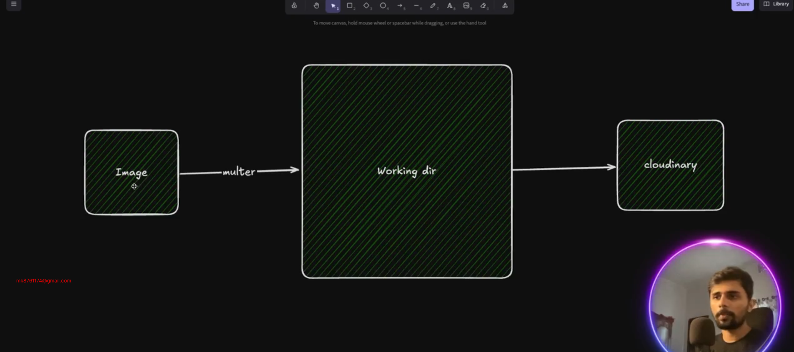
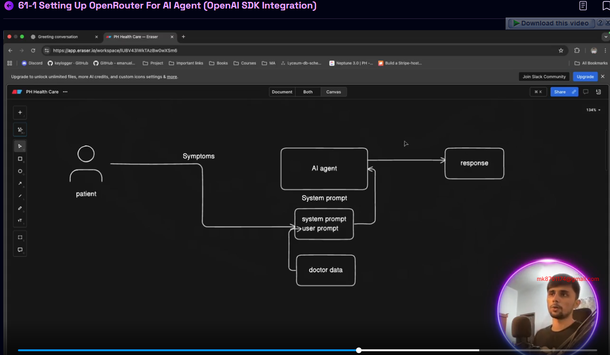

# Patient-Management-And-Authentication-Setup

## 57-1 Creating Patient (User) – Part 1
- app.ts 

```ts 
import express, { Application, NextFunction, Request, Response } from 'express';
import cors from 'cors';
import globalErrorHandler from './app/middlewares/globalErrorHandler';
import notFound from './app/middlewares/notFound';
import config from './config';

import router from './app/routes';

const app: Application = express();
app.use(cors({
    origin: 'http://localhost:3000',
    credentials: true
}));

//parser
app.use(express.json());
app.use(express.urlencoded({ extended: true }));

app.use("/api/v1", router)


app.get('/', (req: Request, res: Response) => {
    res.send({
        message: "Server is running..",
        environment: config.node_env,
        uptime: process.uptime().toFixed(2) + " sec",
        timeStamp: new Date().toISOString()
    })
});


app.use(globalErrorHandler);

app.use(notFound);

export default app;
```

- src -> app -> modules -> user.routes.ts 

```ts 
import express from 'express'
import { UserController } from './user.controller'

const router = express.Router()

router.post("/create-patient",UserController.createPatient )

export const UserRoutes = router 
```
- src -> app -> modules -> user.controller.ts 

```ts
import { Request, Response } from "express";
import catchAsync from "../../shared/catchAsync";

const createPatient = catchAsync(async (req: Request, res: Response) => {
    console.log("Patient Created! ", req.body)
})


export const UserController = {
    createPatient
}
```

## 57-1 Creating Patient (User) – Part 2
- user.routes.ts 

```ts 
import express from 'express';
import { UserRoutes } from '../modules/user/user.routes';


const router = express.Router();

const moduleRoutes = [
    {
        path: '/user',
        route: UserRoutes
    }
];

moduleRoutes.forEach(route => router.use(route.path, route.route))

export default router;
```
- user.controller.ts 

```ts 
import { Request, Response } from "express";
import catchAsync from "../../shared/catchAsync";
import { UserService } from "./user.service";
import sendResponse from "../../shared/sendResponse";

const createPatient = catchAsync(async (req: Request, res: Response) => {
    console.log("Patient Created! ", req.body)
    const result = await UserService.createPatient(req.body)

    sendResponse(res, {
        statusCode: 201,
        success: true,
        message: "Patient Created Successfully",
        data: result
    })
})


export const UserController = {
    createPatient
}
```
- user.interface.ts 

```ts 
export type createPatientInput = {
    name : string,
    email : string
    password : string
}
```
- user.service.ts 

```ts 
import bcrypt from "bcryptjs";
import { createPatientInput } from "./user.interface";
import { prisma } from "../../shared/prisma";

const createPatient = async (payload: createPatientInput) => {
    const hashedPassword = await bcrypt.hash(payload.password, 10)

    const result = await prisma.$transaction(async (tnx) => {
        await tnx.user.create({
            data: {
                email: payload.email,
                password: hashedPassword
            }
        })

        return await tnx.patient.create({
            data: {
                name: payload.name,
                email: payload.email
            }
        })
    })

    return result
}

export const UserService = {
    createPatient
}
```
# 57-3 Building File Upload Helper with Multer

- For Image Uploading we will use third party package named `cloudinary` with `multer`
- Install Multer

```
npm i multer
```

- install types for multer

```
npm i --save-dev @types/multer
```

- dummy multer functionality
- app -> helper -> fileUploader.ts

```ts
import multer from "multer";

const storage = multer.diskStorage({
  destination: function (req, file, cb) {
    cb(null, "/tmp/my-uploads");
  },
  filename: function (req, file, cb) {
    const uniqueSuffix = Date.now() + "-" + Math.round(Math.random() * 1e9);
    cb(null, file.fieldname + "-" + uniqueSuffix);
  },
});

const upload = multer({ storage: storage });
```
- Now Lets Fix this and optimize for our system. 



app -> helper -> fileUploader.ts

```ts
import multer from 'multer'
import path from 'path'

const storage = multer.diskStorage({
    destination: function (req, file, cb) {
        // cb(null, '/tmp/my-uploads')
        cb(null, path.join(process.cwd(), "/uploads")) //C:\Users\Sazid\my-project\uploads

    },
    filename: function (req, file, cb) {
        const uniqueSuffix = Date.now() + '-' + Math.round(Math.random() * 1E9)
        cb(null, file.fieldname + '-' + uniqueSuffix)
    }
})

const upload = multer({ storage: storage })
```
- Now Install Cloudinary

```
npm install cloudinary
```
- app -> helper -> fileUploader.ts

```ts 
import multer from 'multer'
import path from 'path'
import { v2 as cloudinary } from 'cloudinary'

const storage = multer.diskStorage({
    destination: function (req, file, cb) {
        // cb(null, '/tmp/my-uploads')
        cb(null, path.join(process.cwd(), "/uploads")) //
// D:\NEXT-LEVEL-2\FullStack-fusionist\ph-health-care-server
    },
    filename: function (req, file, cb) {
        const uniqueSuffix = Date.now() + '-' + Math.round(Math.random() * 1E9)
        cb(null, file.fieldname + '-' + uniqueSuffix)
    }
})

const upload = multer({ storage: storage })

// for cloudinary 
const uploadToCloudinary =  async (file : Express.Multer.File) =>{
    
}
```


## 57-4 Implementing Request Validation Middleware & Patient Creation with Zod Schema

- Lets make the mechanism for taking the image to the working directory 


- we have to parse the data then we have to work with it 
- For this we need to add a zod validation 
- install zod 

```
npm install zod
```
- middleware concept 


- user.validation.ts 

```ts 
import z from "zod";

const createPatientValidationSchema = z.object({
    password: z.string(),
    patient: {
        name: z.string({
            error: "Name is Required"
        }),
        email: z.string({
            error: "Email Is Required"
        }),
        address: z.string().optional()
    }
})

export const UserValidation = {
    createPatientValidationSchema
}
```
- lets make the middleware first for checking for all then passing to next 

```ts
import { NextFunction, Request, Response } from "express";
import { ZodObject } from "zod";

const validateRequest = (schema: ZodObject) => async (req: Request, res: Response, next: NextFunction) => {
    try {
        await schema.parseAsync({
            body: req.body
        })
        return next() // this will pass to the next middleware or lastly will go to the controller if no more middleware 
    } catch (error) {
        next(error)
    }
}

export default validateRequest
```


## 57-5 Handling Image Upload using Multer



- app-> helper -> fileUploader.ts 

```ts 

import path from 'path'
import { v2 as cloudinary } from 'cloudinary'
import multer from 'multer'

const storage = multer.diskStorage({
    destination: function (req, file, cb) {
        // cb(null, '/tmp/my-uploads')
        cb(null, path.join(process.cwd(), "/uploads")) //C:\Users\Sazid\my-project\uploads

    },
    filename: function (req, file, cb) {
        const uniqueSuffix = Date.now() + '-' + Math.round(Math.random() * 1E9)
        cb(null, file.fieldname + '-' + uniqueSuffix)
    }
})

const upload = multer({ storage: storage })

// for cloudinary 
const uploadToCloudinary = async (file: Express.Multer.File) => {

}

export const fileUploader = {
    upload
}
```
- user.routes.ts 

```ts 
import express, { NextFunction, Request, Response } from 'express'
import { UserController } from './user.controller'
import { fileUploader } from '../../helper/fileUploader'
import { UserValidation } from './user.validation'

const router = express.Router()

router.post("/create-patient",
    fileUploader.upload.single('file'),
    (req: Request, res: Response, next: NextFunction) => {
        req.body = UserValidation.createPatientValidationSchema.parse(JSON.parse(req.body.data))
        return UserController.createPatient(req, res, next)
    },

)

export const UserRoutes = router 
```

- user.controller.ts 

```ts 
import { Request, Response } from "express";
import catchAsync from "../../shared/catchAsync";
import { UserService } from "./user.service";
import sendResponse from "../../shared/sendResponse";

const createPatient = catchAsync(async (req: Request, res: Response) => {
    console.log("Patient Created! ", req.body)
    const result = await UserService.createPatient(req.body)

    console.log(req.body)

    sendResponse(res, {
        statusCode: 201,
        success: true,
        message: "Patient Created Successfully",
        data: result
    })
})


export const UserController = {
    createPatient
}
```

## 57-6 Parsing Data & Preparing Image for Cloudinary Upload
- update in user.validation.ts 

```ts 
import z from "zod";

const createPatientValidationSchema = z.object({
    password: z.string(),
    patient: z.object(
        {
            name: z.string().nonempty("Name is Required"),
            email: z.string().nonempty("Email Is Required"),
            address: z.string().optional()
        }
    )
})

export const UserValidation = {
    createPatientValidationSchema
}
```
- user.controller.ts 

```ts 
import { Request, Response } from "express";
import catchAsync from "../../shared/catchAsync";
import { UserService } from "./user.service";
import sendResponse from "../../shared/sendResponse";

const createPatient = catchAsync(async (req: Request, res: Response) => {
    // console.log("Patient Created! ", req.body)
    const result = await UserService.createPatient(req)

    // console.log(req.body)

    sendResponse(res, {
        statusCode: 201,
        success: true,
        message: "Patient Created Successfully",
        data: result
    })
})


export const UserController = {
    createPatient
}
```
- user.service.ts 

```ts 
import bcrypt from "bcryptjs";
import { createPatientInput } from "./user.interface";
import { prisma } from "../../shared/prisma";
import { Request } from "express";
import { fileUploader } from "../../helper/fileUploader";

const createPatient = async (req: Request) => {

    if (req.file) {
        const uploadResult = await fileUploader.uploadToCloudinary(req.file)
        console.log(uploadResult)
    }

    const hashedPassword = await bcrypt.hash(req.body.password, 10)

    const result = await prisma.$transaction(async (tnx) => {
        await tnx.user.create({
            data: {
                email: req.body.email,
                password: hashedPassword
            }
        })

        return await tnx.patient.create({
            data: {
                name: req.body.name,
                email: req.body.email
            }
        })
    })

    return result
}

export const UserService = {
    createPatient
}
```
- fileUploader.ts 

```ts 

import path from 'path'
import { v2 as cloudinary } from 'cloudinary'
import multer from 'multer'

const storage = multer.diskStorage({
    destination: function (req, file, cb) {
        // cb(null, '/tmp/my-uploads')
        cb(null, path.join(process.cwd(), "/uploads")) //C:\Users\Sazid\my-project\uploads

    },
    filename: function (req, file, cb) {
        const uniqueSuffix = Date.now() + '-' + Math.round(Math.random() * 1E9)
        cb(null, file.fieldname + '-' + uniqueSuffix)
    }
})

const upload = multer({ storage: storage })

// for cloudinary 
const uploadToCloudinary = async (file: Express.Multer.File) => {
    console.log("file", file)
}

export const fileUploader = {
    upload,
    uploadToCloudinary
}
```


## 57-7 Uploading Image to Cloudinary
- fileUploader.ts 

```ts 

import path from 'path'
import { v2 as cloudinary } from 'cloudinary'
import multer from 'multer'
import config from '../../config'

const storage = multer.diskStorage({
    destination: function (req, file, cb) {
        // cb(null, '/tmp/my-uploads')
        cb(null, path.join(process.cwd(), "/uploads")) //C:\Users\Sazid\my-project\uploads

    },
    filename: function (req, file, cb) {
        const uniqueSuffix = Date.now() + '-' + Math.round(Math.random() * 1E9)
        cb(null, file.fieldname + '-' + uniqueSuffix)
    }
})

const upload = multer({ storage: storage })

// for cloudinary 
const uploadToCloudinary = async (file: Express.Multer.File) => {
    console.log("file", file)

    cloudinary.config({
        cloud_name: config.cloudinary.cloud_name,
        api_key: config.cloudinary.api_key,
        api_secret: config.cloudinary.api_secret
    });

    // Upload an image
    const uploadResult = await cloudinary.uploader
        .upload(
            file.path, {
            public_id: file.filename,
        }
        )
        .catch((error) => {
            console.log(error);
        });

    console.log({uploadResult});

    return uploadResult
}


export const fileUploader = {
    upload,
    uploadToCloudinary
}
```

- user.service.ts 

```ts
import bcrypt from "bcryptjs";
import { createPatientInput } from "./user.interface";
import { prisma } from "../../shared/prisma";
import { Request } from "express";
import { fileUploader } from "../../helper/fileUploader";

const createPatient = async (req: Request) => {

    if (req.file) {
        const uploadResult = await fileUploader.uploadToCloudinary(req.file)
        console.log(uploadResult)
        req.body.patient.profilePhoto = uploadResult?.secure_url
    }

    const hashedPassword = await bcrypt.hash(req.body.password, 10)

    const result = await prisma.$transaction(async (tnx) => {
        await tnx.user.create({
            data: {
                email: req.body.patient.email,
                password: hashedPassword
            }
        })

        return await tnx.patient.create({
            data: req.body.patient
        })
    })

    return result
}

export const UserService = {
    createPatient
}
```

## 57-8 Implementing User Login
- lets login with the created user. 
- auth.routes.ts 

```ts 
import express, { NextFunction, Request, Response } from 'express'
import { AuthController } from './auth.controller'

const router = express.Router()

router.post("/login", AuthController.login)

export const AuthRoutes = router 
```
- auth.controller.ts 

```ts 
import { Request, Response } from "express";
import catchAsync from "../../shared/catchAsync";

import sendResponse from "../../shared/sendResponse";
import { AuthServices } from "./auth.service";

const login = catchAsync(async (req: Request, res: Response) => {

    const result = await AuthServices.login(req.body)

    sendResponse(res, {
        statusCode: 201,
        success: true,
        message: "User Logged In Successfully",
        data: result
    })
})


export const AuthController = {
    login
}
```
- auth.service.ts 

```ts 
import { UserStatus } from "@prisma/client"
import { prisma } from "../../shared/prisma"
import bcrypt from 'bcryptjs';

const login = async (payload: { email: string, password: string }) => {
    const user = await prisma.user.findUniqueOrThrow({
        where: {
            email: payload.email,
            status: UserStatus.ACTIVE
        }
    })

    const isCorrectPassword = await bcrypt.compare(payload.password, user.password)

    if(!isCorrectPassword){
        throw new Error("Password Incorrect")
    }
    // if password correct we will generate token 
}

export const AuthServices = {
    login
}
```

## 57-9 Generating JWT Token

- install jwt 

```
npm i jsonwebtoken
```
- import types for jwt 

```
npm i --save-dev @types/jsonwebtoken
```
- auth.service.ts 

```ts 
import { UserStatus } from "@prisma/client"
import { prisma } from "../../shared/prisma"
import bcrypt from 'bcryptjs';
import jwt from 'jsonwebtoken'

const login = async (payload: { email: string, password: string }) => {
    console.log(payload)
    const user = await prisma.user.findUniqueOrThrow({
        where: {
            email: payload.email,
            status: UserStatus.ACTIVE
        }
    })

    console.log(user)

    const isCorrectPassword = await bcrypt.compare(payload.password, user.password)

    if(!isCorrectPassword){
        throw new Error("Password Incorrect")
    }
    //  generate access token 
    const accessToken = jwt.sign({email: user.email, role: user.role}, "abc", {
        algorithm:"HS256",
        expiresIn :"1h"
    })

    // generate refresh token 
        const refreshToken = jwt.sign({email: user.email, role: user.role}, "abc", {
        algorithm:"HS256",
        expiresIn :"90d"
    })


    return {
        accessToken,
        refreshToken
    }
}

export const AuthServices = {
    login
}
```
