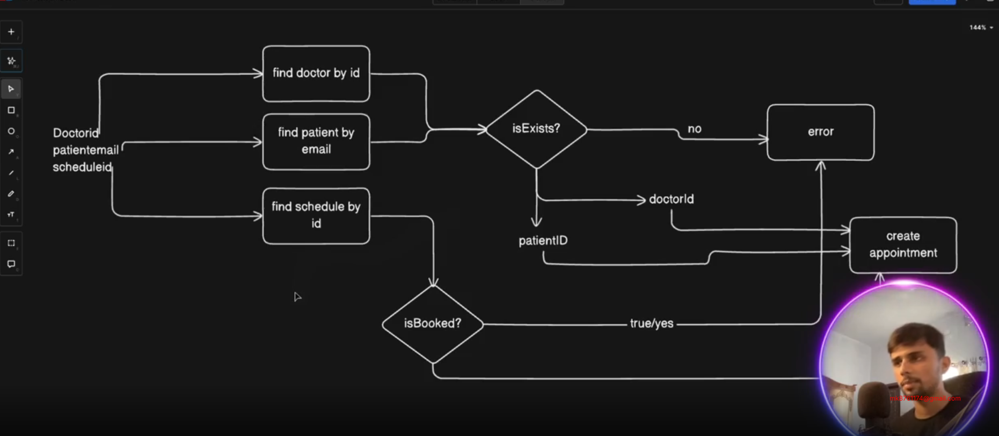

# STRIPE-PAYMENT-INTEGRATION-AND-APPOINTMENT-MANAGEMENT

GitHub Link: https://github.com/Apollo-Level2-Web-Dev/ph-health-care-server/tree/part-7


## 62-1 Stripe Payment Implementation – Part 1



- stripe -> documentation -> get started with payments -> for you -> accept online payment

[stripe](https://docs.stripe.com/checkout/quickstart)

- install stripe 

```
npm install --save stripe
```
- set the .env 

```
STRIPE_SECRET_KEY=
CLIENT_URL=
```

- config -> index.ts 

```ts
import dotenv from 'dotenv';
import path from 'path';

dotenv.config({ path: path.join(process.cwd(), '.env') });

export default {
    node_env: process.env.NODE_ENV,
    port: process.env.PORT,
    database_url: process.env.DATABASE_URL,
    cloudinary: {
        api_secret: process.env.CLOUDINARY_API_SECRET,
        cloud_name: process.env.CLOUDINARY_CLOUD_NAME,
        api_key: process.env.CLOUDINARY_API_KEY
    },
    openRouterApiKey: process.env.OPENROUTER_API_KEY,
    stripeSecretKey: process.env.STRIPE_SECRET_KEY
}
```

- helpers -> stripe.ts 

```ts 
import Stripe from "stripe"
import config from "../../config"

export const stripe = new Stripe(config.stripeSecretKey as string)
```

- create a session for the payment 

```ts 
        const session = await stripe.checkout.sessions.create({
            payment_method_types: ["card"],
            mode: "payment",
            customer_email: user.email,
            line_items: [
                {
                    price_data: {
                        currency: "bdt",
                        product_data: {
                            name: `Appointment with ${doctorData.name}`,
                        },
                        unit_amount: doctorData.appointmentFee * 100,
                    },
                    quantity: 1,
                },
            ],
            metadata: {
                appointmentId: appointmentData.id,
                paymentId: paymentData.id
            },
            success_url: `https://www.programming-hero.com/`,
            cancel_url: `https://next.programming-hero.com/`,
        });
```

- appointment.service.ts 

```ts
import { stripe } from "../../helper/stripe";
import { prisma } from "../../shared/prisma";
import { IJWTPayload } from "../../types/common";
import { v4 as uuidv4 } from 'uuid';

const createAppointment = async (user: IJWTPayload, payload: { doctorId: string, scheduleId: string }) => {
    const patientData = await prisma.patient.findUniqueOrThrow({
        where: {
            email: user.email
        }
    });

    const doctorData = await prisma.doctor.findUniqueOrThrow({
        where: {
            id: payload.doctorId,
            isDeleted: false
        }
    });

    const isBookedOrNot = await prisma.doctorSchedules.findFirstOrThrow({
        where: {
            doctorId: payload.doctorId,
            scheduleId: payload.scheduleId,
            isBooked: false
        }
    })

    const videoCallingId = uuidv4();

    const result = await prisma.$transaction(async (tnx) => {
        const appointmentData = await tnx.appointment.create({
            data: {
                patientId: patientData.id,
                doctorId: doctorData.id,
                scheduleId: payload.scheduleId,
                videoCallingId
            }
        })

        await tnx.doctorSchedules.update({
            where: {
                doctorId_scheduleId: {
                    doctorId: doctorData.id,
                    scheduleId: payload.scheduleId
                }
            },
            data: {
                isBooked: true
            }
        })

        const transactionId = uuidv4();

        const paymentData = await tnx.payment.create({
            data: {
                appointmentId: appointmentData.id,
                amount: doctorData.appointmentFee,
                transactionId
            }
        })

        const session = await stripe.checkout.sessions.create({
            payment_method_types: ["card"],
            mode: "payment",
            customer_email: user.email,
            line_items: [
                {
                    price_data: {
                        currency: "bdt",
                        product_data: {
                            name: `Appointment with ${doctorData.name}`,
                        },
                        unit_amount: doctorData.appointmentFee * 100,
                    },
                    quantity: 1,
                },
            ],
            metadata: {
                appointmentId: appointmentData.id,
                paymentId: paymentData.id
            },
            success_url: `https://www.programming-hero.com/`,
            cancel_url: `https://next.programming-hero.com/`,
        });

        return { paymentUrl: session.url };

        // console.log(session)
    })


    return result;
};


export const AppointmentService = {
    createAppointment,
};
```

## 62-2 Stripe Payment Implementation – Part 2, 62-3 Implementing Stripe Webhook to Verify Payment, 62-4 Handling Webhook & Updating Payment Status – Part 1, 62-5 Handling Webhook & Updating Payment Status – Part 2

- we will use stripe `webhook` for doing the database operation like updating payment status from `unpaid to pain` 

[webhook](https://docs.stripe.com/webhooks/quickstart)

- payment.controller.ts 

```ts 
import { Request, Response } from "express";
// A custom async wrapper that catches and forwards any async errors to your global error handler
import catchAsync from "../../shared/catchAsync";

// Import your payment service logic (the handler that processes different Stripe events)
import { PaymentService } from "./payment.service";

// Utility function to send standardized API responses
import sendResponse from "../../shared/sendResponse";

// Import a preconfigured Stripe instance (with secret key)
import { stripe } from "../../helper/stripe";

/**
 * @description
 * This controller receives incoming Stripe webhook events (POST requests)
 * from Stripe servers. It verifies the signature for security, constructs
 * a Stripe event object, and delegates event handling to `PaymentService`.
 *
 * Stripe webhooks are crucial because they notify your backend when
 * a payment succeeds, fails, or a session completes — even if the user
 * closes the browser before returning to your site.
 */
const handleStripeWebhookEvent = catchAsync(async (req: Request, res: Response) => {

    // ✅ 1. Extract Stripe's signature from the request header.
    // This header allows you to verify that the request truly came from Stripe.
    const sig = req.headers["stripe-signature"] as string;

    // ⚠️ 2. Your webhook secret key from Stripe Dashboard.
    // Each webhook endpoint you create in Stripe has a unique secret.
    // This must match exactly; otherwise, verification will fail.
    const webhookSecret = "";

    let event;

    try {
        // ✅ 3. Verify the incoming webhook signature.
        // `constructEvent` checks the signature and builds a verified Stripe event.
        // If verification fails (e.g., wrong secret or tampered payload),
        // an error is thrown immediately.
        event = stripe.webhooks.constructEvent(req.body, sig, webhookSecret);
    } catch (err: any) {
        // ❌ Signature verification failed — log the error and reject the request.
        console.error("⚠️ Webhook signature verification failed:", err.message);

        // Respond with a 400 Bad Request so Stripe knows your server rejected it.
        return res.status(400).send(`Webhook Error: ${err.message}`);
    }

    // ✅ 4. Pass the verified event to your business logic.
    // The service will decide what to do based on event type (e.g., checkout.session.completed).
    const result = await PaymentService.handleStripeWebhookEvent(event);

    // ✅ 5. Send a standardized success response back to Stripe.
    // Stripe expects a 2xx status code; otherwise, it will retry the webhook.
    // You can log or store the event result if needed.
    sendResponse(res, {
        statusCode: 200,
        success: true,
        message: "Webhook request processed successfully",
        data: result,
    });
});

// Export controller object so routes can easily import and use it
export const PaymentController = {
    handleStripeWebhookEvent,
};

```
- payment.service.ts
```ts
// Import the Stripe SDK to work with Stripe events and sessions
import Stripe from "stripe";

// Import your Prisma client instance to perform database operations
import { prisma } from "../../shared/prisma";

// Import your enum (from Prisma schema) to store standardized payment status values
import { PaymentStatus } from "@prisma/client";

/**
 * Handles all incoming Stripe webhook events.
 * 
 * Webhooks are sent by Stripe whenever an important event happens,
 * e.g. when a checkout session is completed, payment fails, etc.
 * 
 * This function receives a single event object from Stripe and
 * performs corresponding database updates depending on the event type.
 */
const handleStripeWebhookEvent = async (event: Stripe.Event) => {
    // The event type indicates what kind of event occurred.
    // For example: "checkout.session.completed", "payment_intent.succeeded", etc.
    switch (event.type) {

        /**
         * Event: checkout.session.completed
         * 
         * This event is triggered when a Checkout Session has successfully completed,
         * meaning the user has paid successfully or the payment has been authorized.
         */
        case "checkout.session.completed": {
            // The `data.object` property contains the full Stripe session object.
            // We cast it to `any` here because Stripe's generic type can be complex
            // and we specifically know this event relates to a Checkout Session.
            const session = event.data.object as any;

            // Retrieve the custom metadata you attached when creating the Checkout Session.
            // These IDs allow you to connect Stripe events back to your internal database records.
            const appointmentId = session.metadata?.appointmentId;
            const paymentId = session.metadata?.paymentId;

            // 🧾 Update the Appointment record in your database:
            // - Find the appointment by ID (from metadata)
            // - Update its paymentStatus field depending on Stripe's payment status
            await prisma.appointment.update({
                where: {
                    id: appointmentId,
                },
                data: {
                    // Stripe session.payment_status is usually 'paid' or 'unpaid'
                    paymentStatus:
                        session.payment_status === "paid"
                            ? PaymentStatus.PAID
                            : PaymentStatus.UNPAID,
                },
            });

            // 💰 Update the Payment record in your database:
            // - Find the payment by ID (from metadata)
            // - Store Stripe's payment data for future reference
            // - Update the status field similarly to match Stripe's payment result
            await prisma.payment.update({
                where: {
                    id: paymentId,
                },
                data: {
                    status:
                        session.payment_status === "paid"
                            ? PaymentStatus.PAID
                            : PaymentStatus.UNPAID,

                    // Save the entire Stripe session object for debugging,
                    // reconciliation, or refund processing in the future.
                    paymentGatewayData: session,
                },
            });

            // Break so no other event handler runs for this event
            break;
        }

        /**
         * Default handler for any other Stripe event types
         * that your system does not explicitly process.
         * 
         * Keeping this ensures your app logs unhandled events
         * so you can decide later if they need to be supported.
         */
        default:
            console.log(`ℹ️ Unhandled event type: ${event.type}`);
    }
};

/**
 * Exported PaymentService object — a simple pattern
 * that keeps all payment-related logic grouped together.
 */
export const PaymentService = {
    handleStripeWebhookEvent,
};

```

- the webhook route will be called from the stripe. its like when the payment is successful it will be hit by the stripe and will update the payment status, we need to set in stripe site.


- developers - > webhooks -> add destination (stripe dashboard)  


- Here we are gonna set the webhook endpoint


- as we have used cors we will have a cors issue since it will be hit from stripe so we need to define the route in app.ts 

```ts 
// for stripe webhook
router.post(
  "api/v1/payment/webhook",
  express.raw({ type: "application/json" }), // important for signature verification
  PaymentController.handleStripeWebhookEvent
);

```
```ts 
import express, { Application, NextFunction, Request, Response } from 'express';
import cors from 'cors';
import globalErrorHandler from './app/middlewares/globalErrorHandler';
import notFound from './app/middlewares/notFound';
import config from './config';
import cookieParser from 'cookie-parser'

import router from './app/routes';
import { PaymentController } from './app/modules/payment/payment.controller';

const app: Application = express();

// for stripe webhook
router.post(
  "/webhook",
  express.raw({ type: "application/json" }), // important for signature verification
  PaymentController.handleStripeWebhookEvent
);

app.use(cors({
    origin: 'http://localhost:3000',
    credentials: true
}));

//parser
app.use(express.json());
app.use(cookieParser())
app.use(express.urlencoded({ extended: true }));

app.use("/api/v1", router)


app.get('/', (req: Request, res: Response) => {
    res.send({
        message: "Server is running..",
        environment: config.node_env,
        uptime: process.uptime().toFixed(2) + " sec",
        timeStamp: new Date().toISOString()
    })
});


app.use(globalErrorHandler);

app.use(notFound);

export default app;
```


- lets run the web hook locally 


[stripe-locally-running-webhook](https://docs.stripe.com/stripe-cli/install?install-method=windows)

- after installation 

- login to stripe 

```
stripe login
```
- grant from the site 
- run the stripe locally 

```
stripe listen --forward-to localhost:3000/webhook
```
- this will give us a webhook secret. we need to set this in the controller

```ts
const webhookSecret = ""
```
- we can see the console where we run 

## 62-6 Fetching Appointments for Doctor or Patient, 62-7 Troubleshooting Issues in Fetching Appointments & Finding Solutions
- appointment.route.ts 

```ts 
import express from "express";
import { AppointmentController } from "./appointment.controller";
import auth from "../../middlewares/auth";
import { UserRole } from "@prisma/client";

const router = express.Router();

router.get("/my-appointments", auth(UserRole.PATIENT), AppointmentController.getMyAppointment )


export const AppointmentRoutes = router;
```
- appointment.route.ts 

```ts 
import { Request, Response } from "express";
import catchAsync from "../../shared/catchAsync";
import { AppointmentService } from "./appointment.service";
import sendResponse from "../../shared/sendResponse";
import { IJWTPayload } from "../../types/common";
import pick from "../../helper/pick";


const getMyAppointment = catchAsync(async (req: Request & { user?: IJWTPayload }, res: Response) => {
    const options = pick(req.query, ["page", "limit", "sortBy", "sortOrder"]);
    const filters = pick(req.query, ["status", "paymentStatus"])
    const user = req.user
    const result = await AppointmentService.getMyAppointment(user as IJWTPayload, filters, options);

    sendResponse(res, {
        statusCode: 200,
        success: true,
        message: "Appointment Retrieved successfully!",
        data: result
    })
});

export const AppointmentController = {
    getMyAppointment
}
```
- appointment.service.ts 

```ts 
import { Prisma, UserRole } from "@prisma/client";
import { IOptions, paginationHelper } from "../../helper/paginationHelper";
import { stripe } from "../../helper/stripe";
import { prisma } from "../../shared/prisma";
import { IJWTPayload } from "../../types/common";
import { v4 as uuidv4 } from 'uuid';


const getMyAppointment = async (user: IJWTPayload, filters: any, options: IOptions) => {
    const { page, limit, skip, sortBy, sortOrder } = paginationHelper.calculatePagination(options)
    const { ...filtersData } = filters;

    const andConditions: Prisma.AppointmentWhereInput[] = [];

    if (user.role === UserRole.PATIENT) {
        andConditions.push({
            patient: {
                email: user.email
            }
        })
    }
    else if (user.role === UserRole.DOCTOR) {
        andConditions.push({
            doctor: {
                email: user.email
            }
        })
    }

    if (Object.keys(filtersData).length > 0) {
        const filterConditions = Object.keys(filtersData).map(key => ({
            [key]: {
                equals: (filtersData as any)[key]
            }
        }))

        andConditions.push(...filterConditions)
    }

    const whereConditions: Prisma.AppointmentWhereInput = andConditions.length > 0 ? { AND: andConditions } : {}

    const result = await prisma.appointment.findMany({
        where: whereConditions,
        skip,
        take: limit,
        orderBy: {
            [sortBy]: sortOrder
        },
        include: user.role === UserRole.DOCTOR ?
            { patient: true } : { doctor: true }

    });

    const total = await prisma.appointment.count({
        where: whereConditions
    })

    return {
        meta: {
            total,
            limit,
            page
        },
        data: result
    }

}

export const AppointmentService = {
    getMyAppointment
};
```


##  62-8 Updating Appointment Status – Part 1, 62-9 Updating Appointment Status – Part 2

- appointment.routes.ts 

```ts 
import express from "express";
import { AppointmentController } from "./appointment.controller";
import auth from "../../middlewares/auth";
import { UserRole } from "@prisma/client";

const router = express.Router();


router.patch("/status/:id",
    auth(UserRole.ADMIN, UserRole.DOCTOR),
    AppointmentController.updateAppointmentStatus
)


export const AppointmentRoutes = router;
```
- appointment.controller.ts 

```ts 
import { Request, Response } from "express";
import catchAsync from "../../shared/catchAsync";
import { AppointmentService } from "./appointment.service";
import sendResponse from "../../shared/sendResponse";
import { IJWTPayload } from "../../types/common";
import pick from "../../helper/pick";


const updateAppointmentStatus = catchAsync(async (req: Request & { user?: IJWTPayload }, res: Response) => {
    const { id } = req.params;
    const { status } = req.body

    const user = req.user
    const result = await AppointmentService.updateAppointmentStatus(id, status, user as IJWTPayload);

    sendResponse(res, {
        statusCode: 200,
        success: true,
        message: "Appointment Updated successfully!",
        data: result
    })
});


export const AppointmentController = {
    updateAppointmentStatus
}
```
- appointment.service.ts 

```ts 
import { AppointmentStatus, Prisma, UserRole } from "@prisma/client";
import { IOptions, paginationHelper } from "../../helper/paginationHelper";
import { stripe } from "../../helper/stripe";
import { prisma } from "../../shared/prisma";
import { IJWTPayload } from "../../types/common";
import { v4 as uuidv4 } from 'uuid';
import ApiError from "../../errors/ApiError";
import httpStatus from 'http-status';

const updateAppointmentStatus = async (appointmentId: string, status: AppointmentStatus, user: IJWTPayload) => {
    const appointmentData = await prisma.appointment.findUniqueOrThrow({
        where: {
            id: appointmentId
        },
        include: {
            doctor: true
        }
    });

    if (user.role === UserRole.DOCTOR) {
        if (!(user.email === appointmentData.doctor.email)) {
            throw new ApiError(httpStatus.BAD_REQUEST, "This is not your appointment")
        }
    }

    return await prisma.appointment.update({
        where: {
            id: appointmentId
        },
        data: {
            status
        }
    })
}

export const AppointmentService = {

    updateAppointmentStatus
};
```

## 62-10 Creating Prescription for a Completed Appointment

- prescription.routes.ts

```ts 
import { UserRole } from '@prisma/client';
import express from 'express';
import auth from '../../middlewares/auth';
import { PrescriptionController } from './prescription.controller';
const router = express.Router();


router.post(
    "/",
    auth(UserRole.DOCTOR),
    PrescriptionController.createPrescription
);

export const PrescriptionRoutes = router;
```
- prescription.controller.ts

```ts 
import { Request, Response } from "express";
import catchAsync from "../../shared/catchAsync";
import { IJWTPayload } from "../../types/common";
import sendResponse from "../../shared/sendResponse";
import { PrescriptionService } from "./prescription.service";

const createPrescription = catchAsync(async (req: Request & { user?: IJWTPayload }, res: Response) => {
    const user = req.user;
    const result = await PrescriptionService.createPrescription(user as IJWTPayload, req.body)

    sendResponse(res, {
        statusCode: 201,
        success: true,
        message: "Prescription created successfully!",
        data: result
    })
})


export const PrescriptionController = {
    createPrescription
}
```
- prescription.service.ts

```ts 
import { AppointmentStatus, PaymentStatus, Prescription, UserRole } from "@prisma/client";
import { IJWTPayload } from "../../types/common";
import { prisma } from "../../shared/prisma";
import ApiError from "../../errors/ApiError";
import httpStatus from 'http-status'

const createPrescription = async (user: IJWTPayload, payload: Partial<Prescription>) => {
    const appointmentData = await prisma.appointment.findUniqueOrThrow({
        where: {
            id: payload.appointmentId,
            status: AppointmentStatus.COMPLETED,
            paymentStatus: PaymentStatus.PAID
        },
        include: {
            doctor: true
        }
    })

    if (user.role === UserRole.DOCTOR) {
        if (!(user.email === appointmentData.doctor.email))
            throw new ApiError(httpStatus.BAD_REQUEST, "This is not your appointment")
    }

    const result = await prisma.prescription.create({
        data: {
            appointmentId: appointmentData.id,
            doctorId: appointmentData.doctorId,
            patientId: appointmentData.patientId,
            instructions: payload.instructions as string,
            followUpDate: payload.followUpDate || null
        },
        include: {
            patient: true
        }
    });

    return result;
}

// get my prescription as a patient

export const PrescriptionService = {
    createPrescription
}
```