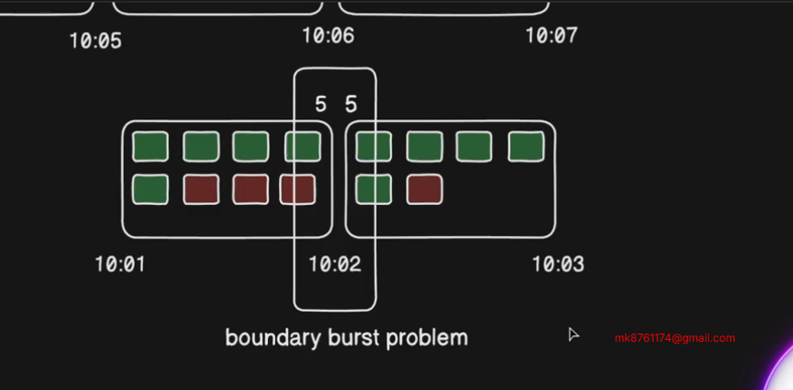
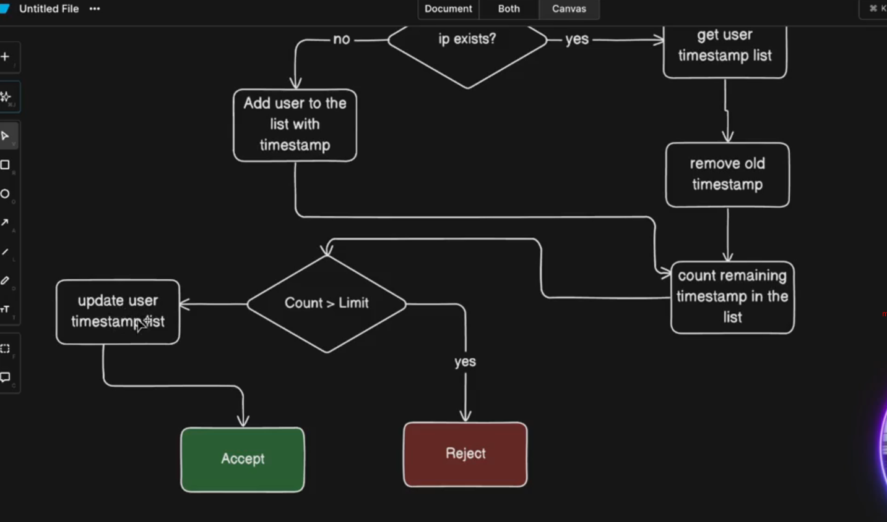

# TASK-SCHEDULING-DASHBOARD-ANALYSIS-BONUS

https://github.com/Apollo-Level2-Web-Dev/ph-health-care-server/tree/part-9

https://github.com/Apollo-Level2-Web-Dev/rate-limiting


## 64-1 Designing Strategy to Cancel Unpaid Appointments

- The strategy will be like when we book an appointment we will get 30 minutes of time to complete the payment. If not paid withing the 30 minute the payment and the appointment will be deleted and the isBooked status will be false again. 


- basically we will create a cron job  using `node cron npm` that will call in every minute and check if unpaid and if 30 minute exceeded then will do the operation for the unpaid appointments. 

```
npm i node-cron
```
- install the node cron

## 64-2 Implementing Task Scheduling with Node Cron

- appointment.service.ts 

```ts 
import { stripe } from "../../helper/stripe";
import { prisma } from '../../shared/prisma';
import { IJWTPayload } from "../../types/common";
import { v4 as uuidv4 } from 'uuid';
import { IOptions, paginationHelper } from "../../helper/paginationHelper";
import { AppointmentStatus, PaymentStatus, Prisma, UserRole } from "@prisma/client";
import ApiError from "../../errors/ApiError";
import httpStatus from 'http-status'


const cancelUnpaidAppointments = async () => {
    const thirtyMinuteAgo = new Date(Date.now() - 30 * 60 * 1000)
    //  time prior 30 minute 

    // find the appointments that are unpaid and created thirty minute before
    const unPaidAppointments = await prisma.appointment.findMany({
        where: {
            createdAt: {
                lte: thirtyMinuteAgo
            },
            paymentStatus: PaymentStatus.UNPAID
        }
    })

    const appointmentIdsToCancel = unPaidAppointments.map(appointment => appointment.id);

    await prisma.$transaction(async (tnx) => {
        // delete the payment
        await tnx.payment.deleteMany({
            where: {
                appointmentId: {
                    in: appointmentIdsToCancel
                }
            }
        })

        // delete appointment 

        await tnx.appointment.deleteMany({
            where: {
                id: {
                    in: appointmentIdsToCancel
                }
            }
        })

        // update the isBooked Status 
        for (const unPaidAppointment of unPaidAppointments) {
            await tnx.doctorSchedules.update({
                where: {
                    doctorId_scheduleId: {
                        doctorId: unPaidAppointment.doctorId,
                        scheduleId: unPaidAppointment.scheduleId
                    }
                },
                data: {
                    isBooked: false
                }
            })
        }

    })
}

export const AppointmentService = {
    cancelUnpaidAppointments
};
```
## 64-3 Testing Unpaid Appointment Cancellations

- now lets use node cron to call the function in every minutes 

- as app.ts runs continuously so we have to do cronjob here.

 ```
# ┌────────────── second (optional)
 # │ ┌──────────── minute
 # │ │ ┌────────── hour
 # │ │ │ ┌──────── day of month
 # │ │ │ │ ┌────── month
 # │ │ │ │ │ ┌──── day of week
 # │ │ │ │ │ │
 # │ │ │ │ │ │
 # * * * * * *
 ```

- app.ts

```ts 
// added for cronjob - 5 start means it will call in every minute  
cron.schedule('* * * * *', () => {
    try {
        console.log('Node Cron called at', new Date());
        AppointmentService.cancelUnpaidAppointments()

    } catch (error) {
        console.log(error)
    }

});
// ___________________
```
- full app.ts 

```ts 
import express, { Application, NextFunction, Request, Response } from 'express';
import cors from 'cors';
import globalErrorHandler from './app/middlewares/globalErrorHandler';
import notFound from './app/middlewares/notFound';
import config from './config';
import router from './app/routes';
import cookieParser from 'cookie-parser'
import { PaymentController } from './app/modules/payment/payment.controller';

import cron from 'node-cron';
import { AppointmentService } from './app/modules/appointment/appointment.service';


const app: Application = express();

app.post(
    "/webhook",
    express.raw({ type: "application/json" }),
    PaymentController.handleStripeWebhookEvent
);
app.use(cors({
    origin: 'http://localhost:3001',
    credentials: true
}));

//parser
app.use(express.json());
app.use(cookieParser());
app.use(express.urlencoded({ extended: true }));


// added for cronjob - 5 start means it will call in every minute  
cron.schedule('* * * * *', () => {
    try {
        console.log('Node Cron called at', new Date());
        AppointmentService.cancelUnpaidAppointments()

    } catch (error) {
        console.log(error)
    }

});
// ___________________

app.use("/api/v1", router);

app.get('/', (req: Request, res: Response) => {
    res.send({
        message: "Server is running..",
        environment: config.node_env,
        uptime: process.uptime().toFixed(2) + " sec",
        timeStamp: new Date().toISOString()
    })
});

app.use(globalErrorHandler);

app.use(notFound);

export default app;
```
## 64-4 Fetching Dashboard Metadata – Part 1, 64-5 Fetching Dashboard Metadata – Part 2, 64-6 Fetching Dashboard Metadata – Part 3

- meta.routes.ts 

```ts 
import express from 'express';
import { MetaController } from './meta.controller';
import auth from '../../middlewares/auth';
import { UserRole } from '@prisma/client';

const router = express.Router();

router.get(
    '/',
    auth(UserRole.ADMIN, UserRole.DOCTOR, UserRole.PATIENT),
    MetaController.fetchDashboardMetaData
)


export const MetaRoutes = router;
```

- meta.controller.ts 

```ts 
import { Request, Response } from "express";
import { MetaService } from "./meta.service";
import httpStatus from "http-status";
import catchAsync from "../../shared/catchAsync";
import { IJWTPayload } from "../../types/common";
import sendResponse from "../../shared/sendResponse";


const fetchDashboardMetaData = catchAsync(async (req: Request & { user?: IJWTPayload }, res: Response) => {

    const user = req.user;
    const result = await MetaService.fetchDashboardMetaData(user as IJWTPayload);

    sendResponse(res, {
        statusCode: httpStatus.OK,
        success: true,
        message: "Meta data retrival successfully!",
        data: result
    })
});

export const MetaController = {
    fetchDashboardMetaData
}
```

- meta.service.ts 

```ts 
import { PaymentStatus, UserRole } from "@prisma/client";
import { IJWTPayload } from "../../types/common";
import httpStatus from 'http-status'
import ApiError from "../../errors/ApiError";
import { prisma } from "../../shared/prisma";


const fetchDashboardMetaData = async (user: IJWTPayload) => {
    let metadata;
    switch (user.role) {
        case UserRole.ADMIN:
            metadata = await getAdminMetaData();
            break;
        case UserRole.DOCTOR:
            metadata = await getDoctorMetaData(user);
            break;
        case UserRole.PATIENT:
            metadata = await getPatientMetaData(user);
            break;
        default:
            throw new ApiError(httpStatus.BAD_REQUEST, "Invalid user role!")
    }

    return metadata;
};


const getDoctorMetaData = async (user: IJWTPayload) => {
    const doctorData = await prisma.doctor.findUniqueOrThrow({
        where: {
            email: user?.email
        }
    });

    const appointmentCount = await prisma.appointment.count({
        where: {
            doctorId: doctorData.id
        }
    });

    const patientCount = await prisma.appointment.groupBy({
        by: ['patientId'],
        _count: {
            id: true
        }
    });

    const reviewCount = await prisma.review.count({
        where: {
            doctorId: doctorData.id
        }
    });

    const totalRevenue = await prisma.payment.aggregate({
        _sum: {
            amount: true
        },
        where: {
            appointment: {
                doctorId: doctorData.id
            },
            status: PaymentStatus.PAID
        }
    });

    const appointmentStatusDistribution = await prisma.appointment.groupBy({
        by: ['status'],
        _count: { id: true },
        where: {
            doctorId: doctorData.id
        }
    });

    const formattedAppointmentStatusDistribution = appointmentStatusDistribution.map(({ status, _count }) => ({
        status,
        count: Number(_count.id)
    }))

    return {
        appointmentCount,
        reviewCount,
        patientCount: patientCount.length,
        totalRevenue,
        formattedAppointmentStatusDistribution
    }
}

const getPatientMetaData = async (user: IJWTPayload) => {
    const patientData = await prisma.patient.findUniqueOrThrow({
        where: {
            email: user?.email
        }
    });

    const appointmentCount = await prisma.appointment.count({
        where: {
            patientId: patientData.id
        }
    });

    const prescriptionCount = await prisma.prescription.count({
        where: {
            patientId: patientData.id
        }
    });

    const reviewCount = await prisma.review.count({
        where: {
            patientId: patientData.id
        }
    });

    const appointmentStatusDistribution = await prisma.appointment.groupBy({
        by: ['status'],
        _count: { id: true },
        where: {
            patientId: patientData.id
        }
    });

    const formattedAppointmentStatusDistribution = appointmentStatusDistribution.map(({ status, _count }) => ({
        status,
        count: Number(_count.id)
    }))

    return {
        appointmentCount,
        prescriptionCount,
        reviewCount,
        formattedAppointmentStatusDistribution
    }
}


const getAdminMetaData = async () => {
    const patientCount = await prisma.patient.count();
    const doctorCount = await prisma.doctor.count();
    const adminCount = await prisma.admin.count();
    const appointmentCount = await prisma.appointment.count()
    const paymentCount = await prisma.payment.count()

    const totalRevenue = await prisma.payment.aggregate({
        _sum: {
            amount: true
        },
        where: {
            status: PaymentStatus.PAID
        }
    })

    const barChartData = await getBarChartData();
    const pieChartData = await getPieChartData();

    return {
        patientCount,
        doctorCount,
        adminCount,
        appointmentCount,
        paymentCount,
        totalRevenue,
        barChartData,
        pieChartData
    }

}


const getBarChartData = async () => {
    const appointmentCountPerMonth = await prisma.$queryRaw`
        SELECT DATE_TRUNC('month', "createdAt") AS month,
        CAST(COUNT(*) AS INTEGER) AS count
        FROM "appointments"
        GROUP BY month
        ORDER BY month ASC
    `

    return appointmentCountPerMonth
}

const getPieChartData = async () => {
    const appointmentStatusDistribution = await prisma.appointment.groupBy({
        by: ['status'],
        _count: { id: true }
    });

    const formatedAppointmentStatusDistribution = appointmentStatusDistribution.map(({ status, _count }) => ({
        status,
        count: Number(_count.id)
    }));

    return formatedAppointmentStatusDistribution;
}


export const MetaService = {
    fetchDashboardMetaData
}
```


## 64-7 Bonus-1- Understanding the Concept of Fixed Window Rate Limiting, 64-8 Bonus-2- System Design & Practical Implementation of Fixed Window Rate Limiting

- fixed widows rate limiting


- rate limiting means how many request we can accept within a time. 
- It like we are telling from one Ip we will allow 5 request in one minute.
- The purpose of rate limiting is when too many requests the server might crash or server will shut down. 

#### Fixed Window Rate Limiting 

!


- in a separate file of another project 
- server.ts 
```ts 
const http = require('http');

// =======================
// Rate Limiter Settings
// =======================
const rateLimitWindow = 60 * 1000; // Time window: 1 minute
const maxRequests = 5;             // Maximum allowed requests per IP within the time window
const ipRequests = {};             // Object to track requests per IP: { ip: { count, startTime } }

/**
 * -----------------------------
 * Simple Fixed-Window Rate Limiter
 * -----------------------------
 * Logic:
 * - Each IP address gets a fixed 1-minute window.
 * - If the IP makes more than `maxRequests` within that window → block it.
 * - When the window expires, the counter resets.
 */
const rateLimitMiddleware = (req, res) => {
    const ip = req.socket.remoteAddress; // Get client IP address
    const currentTime = Date.now();      // Current timestamp

    // If IP is seen for the first time, initialize its tracking info
    if (!ipRequests[ip]) {
        ipRequests[ip] = {
            count: 1,
            startTime: currentTime,
        };
    }
    else {
        // If still within the same time window
        if (currentTime - ipRequests[ip].startTime < rateLimitWindow) {
            ipRequests[ip].count += 1; // Increase the request count
        }
        else {
            // If window has expired → reset counter and start a new window
            ipRequests[ip] = {
                count: 1,
                startTime: currentTime,
            };
        }
    }

    // =======================
    // Check Rate Limit Status
    // =======================
    if (ipRequests[ip].count > maxRequests) {
        // Too many requests from this IP → block it
        res.writeHead(429, { 'Content-Type': 'text/plain' }); // 429 = Too Many Requests
        res.end('Too Many Requests. Please try again later.');
        return false; // Stop request handling
    }

    // Request allowed → continue
    return true;
};

// =======================
// HTTP Server Setup
// =======================
const server = http.createServer((req, res) => {
    // Apply rate limiting before handling the request
    if (!rateLimitMiddleware(req, res)) return;

    // Handle successful requests
    res.statusCode = 200;
    res.setHeader('Content-Type', 'text/plain');
    res.end(`Passed \tDate: ${new Date().toISOString()}\n`);
});

// =======================
// Start the Server
// =======================
server.listen(3000, () => {
    console.log('🚀 Server running at http://localhost:3000');
});

```

## 64-9 Bonus-3- Understanding the Concept of Sliding Window Rate Limiting, 64-10 Bonus-4- System Design & Practical Implementation of Sliding Window Rate Limiting

- there is a problem with the fixed windowed rate limiting like when in boundary line there might come some many request then system performance will drop and server might shut down 


- this problem is called `boundary Burst Problem`

- Thi problem is resolved by `sliding rate limiting`


- in another file 
- server.ts 
```ts 
const http = require('http');

// Configuration
const rateLimitWindowMs = 60 * 1000; // 1 minute window
const maxRequestsPerWindow = 5;
const ipRequests = {}; // Store timestamps per IP: { 'ip': [timestamp1, timestamp2, ...] }

/**
 * Sliding Window Rate Limiter
 * ----------------------------------
 * The sliding window algorithm continuously tracks requests within a moving time window.
 * For each request:
 *   1. Remove timestamps older than the current window.
 *   2. Count how many requests remain (still within the window).
 *   3. If the count >= limit → block the request.
 *   4. Otherwise, allow it and record the timestamp.
 */
const rateLimitMiddleware = (req, res) => {
    const ip = req.socket.remoteAddress; // Identify user by IP
    const currentTime = Date.now();

    // Initialize request history for this IP if it doesn't exist
    if (!ipRequests[ip]) {
        ipRequests[ip] = [];
    }

    // Remove timestamps that fall outside the sliding window
    ipRequests[ip] = ipRequests[ip].filter(timestamp => {
        return currentTime - timestamp < rateLimitWindowMs;
    });

    // Calculate the number of requests within the window
    const requestCount = ipRequests[ip].length; // 0 base count

    // If request count exceeds or equals the allowed limit, reject the request
    if (requestCount >= maxRequestsPerWindow) {
        const retryAfter = Math.ceil(
            (rateLimitWindowMs - (currentTime - ipRequests[ip][0])) / 1000
        ); // Calculate seconds until user can retry

        res.statusCode = 429; // Too Many Requests
        res.setHeader('Content-Type', 'text/plain');
        res.setHeader('Retry-After', retryAfter); // Standard header for rate limits
        res.end(`Too many requests. Try again in ${retryAfter} seconds.`);
        return false;
    }

    // Otherwise, allow the request and record the timestamp
    ipRequests[ip].push(currentTime);
    return true;
};

// Create HTTP server
const server = http.createServer((req, res) => {
    if (!rateLimitMiddleware(req, res)) return; // Apply rate limiting before handling request

    res.statusCode = 200;
    res.setHeader('Content-Type', 'text/plain');
    res.end('Hello, world!');
});

// Start the server
server.listen(3000, () => {
    console.log('Server running at http://localhost:3000');
});

```
- boundary burst problem it means end of the rate limit time and start time coming the request 


- solution use sliding window rate limiting


